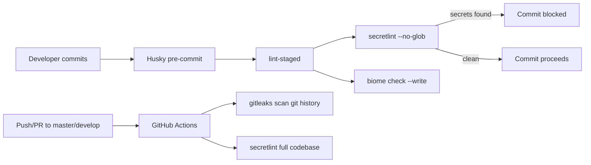

# 2026-04-05 Session Log

**Summary:** Implemented secret scanning (secretlint + gitleaks), killed stale MCP process, diagnosed frontend auth error.

---

## Session 1: Secret Scanning Implementation + Dev Debugging

**Status:** Complete

### System Flow

### Affected Components

| Layer | Components |
|-------|------------|
| DevOps | Husky pre-commit, lint-staged, GitHub Actions |
| Config | .secretlintrc.json, .secretlintignore, .gitleaks.toml |
| CI | .github/workflows/secret-scan.yml |
| Backend | MCP service (port conflict) |
| Frontend | App auth flow (API server not running) |

### What was done

- [x] Evaluated secret scanning tools (secretlint vs gitleaks vs GitHub Secret Scanning)
- [x] Installed secretlint, recommended rule preset, no-homedir rule, lint-staged as devDependencies
- [x] Created `.secretlintrc.json` with recommended + no-homedir rules
- [x] Created `.secretlintignore` for binaries, node_modules, dist, lockfiles
- [x] Added lint-staged config to `package.json` (secretlint on text files, biome on code files)
- [x] Added `secretlint` script to `package.json`
- [x] Created `.gitleaks.toml` with default rules and repo-specific allowlist
- [x] Created `.github/workflows/secret-scan.yml` (gitleaks + secretlint on push/PR)
- [x] Verified secretlint detects Slack tokens, npm tokens (confirmed working)
- [x] Verified no false positives on existing codebase
- [x] Killed stale process (PID 39362) on port 3006 blocking MCP service
- [x] Diagnosed frontend auth errors — API server wasn't running, not a code bug

### Files changed

- `package.json` — added devDependencies (secretlint, lint-staged, rule packages), lint-staged config, secretlint script
- `.secretlintrc.json` — new, secretlint rules configuration
- `.secretlintignore` — new, file exclusions for secretlint
- `.gitleaks.toml` — new, gitleaks configuration with allowlist
- `.github/workflows/secret-scan.yml` — new, CI workflow for gitleaks + secretlint
- `bun.lockb` — updated with new dependencies

### Key decisions

- **Decision:** Use both secretlint (pre-commit) and gitleaks (CI) rather than just one
  - **Context:** No secret scanning existed; CLAUDE.md mandates "no secrets in repo"
  - **Rationale:** Defense-in-depth — local prevention + CI detection covers different failure modes

- **Decision:** Run secretlint via lint-staged with `--no-glob` on scoped file types
  - **Context:** Initial attempt with `*` glob on all staged files caused OOM/SIGKILL
  - **Rationale:** Scoping to text file extensions and using `--no-glob` (lint-staged passes file paths directly) keeps pre-commit fast

- **Decision:** Frontend auth error was runtime, not code
  - **Context:** 401s on `/onboarding` for org settings and darkroom capabilities
  - **Rationale:** Traced through interceptor → useAuthedService → Clerk getToken flow; auth code was correct, API server simply wasn't running

### Mistakes and fixes

- **Mistake:** Initial lint-staged config used `"*"` glob for secretlint, causing it to process 886+ files and get killed → **Fix:** Scoped to `"*.{js,ts,jsx,tsx,json,css,yml,yaml,md,toml,env*}"` with `--no-glob` flag

### Next steps

- [ ] Commit secretlint + gitleaks changes to `develop` branch
- [ ] Test pre-commit hook end-to-end with a real staged commit
- [ ] Consider adding secretlint to the existing CI lint job for unified reporting
