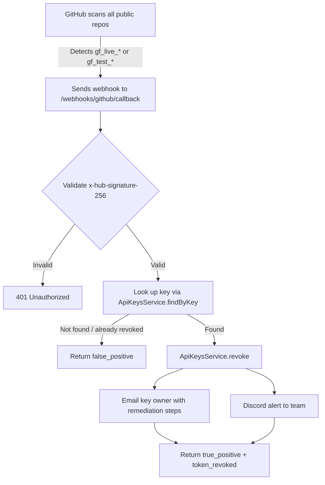

# Session: 2026-04-07

## Summary

Removed Blacksmith CI runners in favor of standard GitHub-hosted runners to reduce CI costs. Implemented GitHub Secret Scanning Partner Program integration with auto-revocation webhook endpoint and custom gitleaks rule for detecting leaked `gf_*` API keys. Fixed 12 bugs from Codex bot PR reviews across 7 merged PRs.

## Session 1: Remove Blacksmith Runners

**Status:** Complete

### Affected Components

| Layer | Components |
|-------|------------|
| CI/CD | `build-verify.yml`, `_deploy.yml` |

### What was done

- [x] Identified all Blacksmith runner references across GitHub workflows (2 files, 5 occurrences)
- [x] Replaced `blacksmith-4vcpu-ubuntu-2404` and `blacksmith-8vcpu-ubuntu-2404` with `ubuntu-latest` in `_deploy.yml` (3 jobs: test-changed, build-unified-image, deploy-services)
- [x] Replaced `blacksmith-4vcpu-ubuntu-2404` with `ubuntu-latest` in `build-verify.yml`
- [x] Swapped `useblacksmith/setup-docker-builder@v1` with `docker/setup-buildx-action@v3` in `build-verify.yml`

### Files changed

- `.github/workflows/build-verify.yml` - runner changed to `ubuntu-latest`, Buildx action switched from Blacksmith to official Docker
- `.github/workflows/_deploy.yml` - all 3 jobs (`test-changed`, `build-unified-image`, `deploy-services`) switched from Blacksmith to `ubuntu-latest`

### Key decisions

- **Decision:** Use `ubuntu-latest` (4-vCPU) for all jobs, including `build-unified-image` which was on 8-vCPU Blacksmith
  - **Context:** Blacksmith runners were too expensive relative to value
  - **Rationale:** Standard GitHub runners are free for public repos and included in plan minutes; if builds become slow, can upgrade to `ubuntu-latest-8-cores` (GitHub larger runner) later

### Next steps

- [ ] Commit and push changes to verify CI passes on GitHub-hosted runners
- [ ] Monitor Docker build times on `build-unified-image` job — may need `ubuntu-latest-8-cores` if too slow
- [ ] Remove any Blacksmith billing/integration from GitHub org settings if no longer needed

## Session 2: GitHub Secret Scanning Partner Program + Auto-Revocation

**Status:** Complete (pending GitHub partner enrollment confirmation)

### System Flow

### Affected Components

| Layer | Components |
|-------|------------|
| Backend | Webhooks module, API Keys service, Notifications service |
| Config | genfeedai.schema.ts, .env.example |
| CI/CD | .gitleaks.toml (custom rule) |

### What was done

- [x] Added custom gitleaks rule to detect `gf_(live|test)_*` key patterns in CI scans
- [x] Created `GitHubWebhookController` — `POST /webhooks/github/callback` with HMAC-SHA256 signature validation
- [x] Created `GitHubWebhookService` — processes GitHub Secret Scanning alerts, auto-revokes keys, emails owners, sends Discord alerts
- [x] Registered controller + service in `WebhooksModule` with `ApiKeysModule` import
- [x] Added `GITHUB_WEBHOOK_SECRET` to config schema and `.env.example`
- [x] Drafted and sent enrollment email to secret-scanning@github.com

### Files changed

- `.gitleaks.toml` — added `genfeedai-api-key` rule matching `gf_(live|test)_[A-Za-z0-9_\-]{20,}`
- `apps/server/api/src/endpoints/webhooks/github/webhooks.github.controller.ts` — new file, webhook endpoint
- `apps/server/api/src/endpoints/webhooks/github/webhooks.github.service.ts` — new file, alert processing + auto-revocation + notifications
- `apps/server/api/src/endpoints/webhooks/webhooks.module.ts` — registered GitHub controller/service, added ApiKeysModule import
- `packages/config/src/schemas/genfeedai.schema.ts` — added `GITHUB_WEBHOOK_SECRET` env var
- `apps/server/api/.env.example` — added `GITHUB_WEBHOOK_SECRET` placeholder

### Key decisions

- **Decision:** Use GitHub Secret Scanning Partner Program (free) over GitGuardian ($300/mo)
  - **Context:** Need to detect leaked `gf_*` keys across all public GitHub repos, not just our own
  - **Rationale:** Free, covers all of GitHub, and we already have the webhook + revocation infrastructure to handle alerts

- **Decision:** Reuse existing `ApiKeysService.findByKey()` for token lookup in the webhook handler
  - **Context:** `findByKey()` uses SHA-256 fingerprint index for O(1) lookup + bcrypt verification
  - **Rationale:** Already battle-tested, no need for a separate lookup method. It filters `isRevoked: false` so already-revoked keys return `false_positive` automatically

- **Decision:** Follow existing webhook provider pattern (Vercel, Stripe, etc.) exactly
  - **Context:** 9 existing webhook providers all follow the same controller/service/module pattern
  - **Rationale:** Consistency, reviewability, and the existing pattern handles raw body parsing + signature validation correctly

### Mistakes and fixes

- None — straightforward implementation following established patterns

### Next steps

- [ ] Await GitHub's response to partner enrollment email and complete verification handshake
- [ ] Set `GITHUB_WEBHOOK_SECRET` in production environment once GitHub provides it
- [ ] Test endpoint with GitHub's test payloads during verification
- [ ] Commit changes to develop branch and push
- [ ] Consider adding a unit test for `GitHubWebhookService.validateSignature()` and `handleSecretAlert()`

## Session 3: Fix Codex Bot PR Review Bugs

**Status:** Complete

### Affected Components

| Layer | Components |
|-------|------------|
| Backend | NestJS DI imports (10 files), thread compaction, agent orchestrator, models guard, skill runtime |
| Frontend | Issues list page, workflow templates page, workflow new page |

### What was done

**Batch 1: P0 — NestJS DI `import type` fixes (14 imports across 10 files)**
- [x] `models.controller.ts` — ModelsService, LoggerService, ModuleRef
- [x] `redis.service.ts` — LoggerService
- [x] `models.guard.ts` — ModelRegistrationService
- [x] `model-registration.service.ts` — OrganizationSettingsService, LoggerService
- [x] `organization-settings.service.ts` — LoggerService, ModuleRef
- [x] `websocket.service.ts` (files server) — ConfigService
- [x] `replicate-prompt.builder.ts` — ConfigService
- [x] `websockets.service.ts` (libs) — RedisService
- [x] `websockets.gateway.ts` — LoggerService, RedisService
- [x] `events.service.ts` — LoggerService, RedisService

**Batch 2: P1 — Thread compaction safety**
- [x] Added parse validation before advancing `lastIncorporatedMessageId` — prevents data loss on malformed LLM output
- [x] Replaced hard-coded 200-message cap with cursor-based pagination using `lastIncorporatedMessageId`
- [x] Fixed `messageCount` calculation (was always 0 on incremental compaction due to `n - n = 0`)
- [x] Added `getAllMessages()` and `getAllMessagesAfter()` to AgentMessagesService

**Batch 3: P1 — Agent orchestrator tools**
- [x] Fixed `mergeSkillToolOverrides` to accept `undefined` baseTools (returns `undefined` to preserve unrestricted toolset)
- [x] Updated both sync and streaming paths in agent-orchestrator to pass `undefined` instead of `[]` when no agentType

**Batch 4: P1→P2 — Guard + Frontend fixes**
- [x] Added model category validation to ModelsGuard — prevents cross-category model usage (IMAGE on VIDEO endpoint)
- [x] Fixed `WorkflowTemplatesPage.tsx` — stabilized `href` with `useMemo` to prevent duplicate workflow creation
- [x] Fixed `issues-list.tsx` — changed `SelectItem value=""` to `value="all"` (Radix UI crashes on empty string)
- [x] Added ExecutionPanel to `WorkflowNewPageClient.tsx` with `rightPanel` prop

### Files changed

- `apps/server/api/src/collections/models/controllers/models.controller.ts` — DI imports
- `packages/libs/redis/redis.service.ts` — DI imports
- `apps/server/api/src/helpers/guards/models/models.guard.ts` — DI imports + category validation
- `apps/server/api/src/collections/models/services/model-registration.service.ts` — DI imports
- `apps/server/api/src/collections/organization-settings/services/organization-settings.service.ts` — DI imports
- `apps/server/files/src/services/websocket/websocket.service.ts` — DI imports
- `apps/server/api/src/services/prompt-builder/builders/replicate-prompt.builder.ts` — DI imports
- `packages/libs/websockets/websockets.service.ts` — DI imports
- `packages/libs/websockets/websockets.gateway.ts` — DI imports
- `packages/libs/events/events.service.ts` — DI imports
- `apps/server/api/src/services/agent-threading/services/thread-context-compressor.service.ts` — parse validation, cursor pagination, messageCount fix
- `apps/server/api/src/collections/agent-messages/services/agent-messages.service.ts` — new getAllMessages/getAllMessagesAfter methods
- `apps/server/api/src/services/agent-orchestrator/agent-orchestrator.service.ts` — undefined baseTools fix (2 paths)
- `apps/server/api/src/services/skill-runtime/skill-runtime.service.ts` — handle undefined baseTools
- `packages/pages/issues/list/issues-list.tsx` — SelectItem value fix
- `apps/app/src/features/workflows/pages/templates/WorkflowTemplatesPage.tsx` — stable href ref
- `apps/app/app/(protected)/[orgSlug]/[brandSlug]/workflows/new/WorkflowNewPageClient.tsx` — ExecutionPanel + rightPanel

### Key decisions

- **Decision:** Do a repo-wide sweep for `import type` DI bugs instead of only fixing Codex-flagged files
  - **Context:** Codex adversarial review found 5 additional files beyond the original 3
  - **Rationale:** The pattern is mechanical and the bug is silent until runtime — better to fix all at once

- **Decision:** Use cursor-based pagination for compaction instead of raising the 200 limit
  - **Context:** Any fixed limit can be exceeded; cursor-based approach processes exactly the right messages
  - **Rationale:** No data loss regardless of backlog size

### Deferred

- Skill toggle race condition (`use-brand-enabled-skills.ts`) — low-probability UX issue
- Discord channel IDs optional vs required (`notifications.schema.ts`) — only matters with partial Discord config

### Next steps

- [ ] Commit changes and push to develop
- [ ] Verify builds pass: `bun run build --filter=@genfeedai/api`, `bun run build --filter=@genfeedai/redis`
- [ ] Update `models.guard.spec.ts` to test `ModelRegistrationService.validateModelForOrg` flow + category validation
- [ ] Add compaction tests for malformed LLM output, >200 message backlog, incremental messageCount
