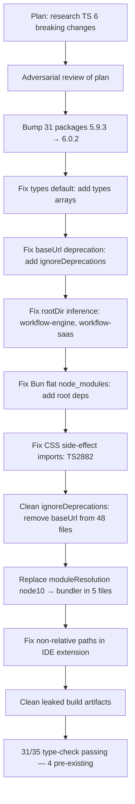
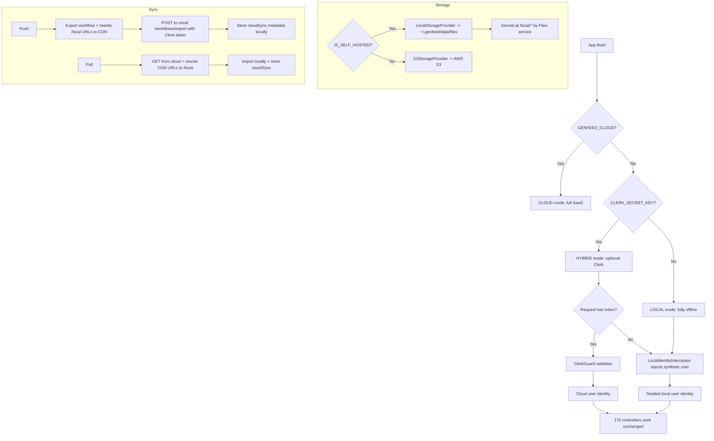

# 2026-04-08 — Config, Button Fix, Codex Fixes, Issue Sweep, Marketplace Extraction, Full Build Fixes, README Badge, TypeScript 6 Migration, Hybrid Mode & Board Cleanup

Session 1-3: Config, ProcessorsModule, Button fix. Session 4: Codex PR review fixes. Session 5: Issue sweep + open-source prep. Session 6: Marketplace extraction (Phases 0-5 complete), docs refresh, 280-file NestJS DI fix, frontend 16/16 clean, backend 5/5 boot clean, publish script, branch cleanup. Session 7: Added CodeRabbit badge to README. Session 8: Full TypeScript 6.0.2 migration — 31 packages bumped, 48 baseUrl removed, 49/53 ignoreDeprecations cleaned, moduleResolution modernized. Session 9: Full hybrid local/cloud mode — 6 phases, 8 commits, ~30 files. IS_SELF_HOSTED bug fix, 3-mode edition system, LocalIdentityInterceptor, auth guards, local file serving, sync service, ModeIndicator UX, storage package source. Session 10: GitHub board audit + cleanup — closed 7 issues (4 stale, 3 implemented), PR #138.

---

## Session 1: Config & CLAUDE.md Updates

**Status:** Complete

### Affected Components

| Layer | Components |
|-------|------------|
| Config | `CLAUDE.md`, `~/.claude/settings.json` |

### What was done

- [x] Added "Research the codebase before editing. Never change code you haven't read." rule to CLAUDE.md under Files & Git section — applies to all agents
- [x] Added `"showThinkingSummaries": true` to `~/.claude/settings.json`

### Files changed

- `CLAUDE.md` — Added codebase-research-before-edit rule at line 89
- `~/.claude/settings.json` — Added `showThinkingSummaries: true` setting

### Key decisions

- **Decision:** Placed the research rule in CLAUDE.md rather than a separate `.agents/rules/` file
  - **Rationale:** CLAUDE.md is loaded by all agents in this repo, ensuring universal coverage without needing additional file references

### Next steps

- [ ] Continue with any pending feature or fix work

---

## Session 2: ProcessorsModule Wiring Verification

**Status:** Complete

### Affected Components

| Layer | Components |
|-------|------------|
| Backend | `apps/server/workers/src/app.module.ts`, `apps/server/workers/src/processors/processors.module.ts` |

### What was done

- [x] Investigated report that `ProcessorsModule` was not imported into workers bootstrap graph
- [x] Read `app.module.ts` and confirmed `ProcessorsModule` is already imported at line 156 with import statement at line 38
- [x] Confirmed no code change was needed — the module is correctly wired

### Files changed

- None — no changes required

### Key decisions

- **Decision:** No fix applied
  - **Context:** A code review comment flagged ProcessorsModule as not being imported into the workers app, which would cause BullMQ jobs to queue indefinitely
  - **Rationale:** The import already exists at `app.module.ts:38` (import statement) and `app.module.ts:156` (module registration). The review comment was inaccurate.

### Next steps

- [ ] Continue with any pending feature or fix work

---

## Session 3: Fix Button withWrapper Regression

**Status:** Complete

### Affected Components

| Layer | Components |
|-------|------------|
| Frontend | `CloudEditorDropdown.tsx`, `CloudWorkflowToolbar.tsx`, `WorkflowSidebarContent.tsx` |

### What was done

- [x] Identified root cause: Button's default `withWrapper=true` wraps the `<button>` in a `
`, which prevents `w-full` from filling parent and breaks `max-w-full truncate` constraints
- [x] Audited all 12 UNSTYLED buttons introduced in commit `d29f3e61` (raw HTML migration) across 9 files
- [x] Confirmed 3 files affected (use `w-full` or `truncate`), remaining 6 files unaffected
- [x] Added `withWrapper={false}` to dropdown action items in `CloudEditorDropdown.tsx` — restores full-width hover/click target
- [x] Added `withWrapper={false}` to workflow name button in `CloudWorkflowToolbar.tsx` — restores text truncation for long names in toolbar
- [x] Added `withWrapper={false}` to search trigger button in `WorkflowSidebarContent.tsx` — restores full-width fill in sidebar

### Files changed

- `apps/app/src/features/workflows/components/editor/CloudEditorDropdown.tsx` — added `withWrapper={false}` to dropdown menu item buttons
- `apps/app/src/features/workflows/components/editor/CloudWorkflowToolbar.tsx` — added `withWrapper={false}` to workflow rename trigger button
- `apps/app/src/features/workflows/components/WorkflowSidebarContent.tsx` — added `withWrapper={false}` to search trigger button

### Key decisions

- **Decision:** Only fix buttons that use `w-full`, `max-w-full`, or `truncate` — not all UNSTYLED buttons
  - **Context:** 12 UNSTYLED buttons were introduced in the migration commit across 9 files
  - **Rationale:** The wrapper only causes visual regression when the button relies on filling its parent or constraining text width; the other 9 UNSTYLED buttons are content-sized and unaffected

### Mistakes and fixes

- None

### Next steps

- [ ] Commit changes and push to develop
- [ ] Visual QA: verify dropdown items fill row, toolbar name truncates, sidebar search button fills width

---

## Session 4: Codex PR Review Fixes — Docs, Docker, Hooks

**Status:** Complete

### Affected Components

| Layer | Components |
|-------|------------|
| Docs | `apps/docs/content/getting-started.mdx` |
| Docker | `docker/Dockerfile.selfhosted`, `docker/selfhosted-entrypoint.sh` |
| Frontend | `packages/hooks/data/skills/use-brand-enabled-skills.ts` |

### What was done

- [x] Fixed CLI examples in getting-started.mdx: `generate --prompt` → `generate image`, `workflows` → `workflow` (singular), positional arg syntax
- [x] Fixed Dockerfile.selfhosted: all 5 `apps/web` references → `apps/app` (build was broken — directory doesn't exist)
- [x] Fixed TOKEN_ENCRYPTION_KEY in entrypoint: now persists to `/data/.encryption-key` on first boot, reuses on restarts (was regenerating from `/dev/urandom` every boot, breaking encrypted data)
- [x] Removed all hardcoded ports in entrypoint — API, Workers, Files, Notifications, and Next.js ports all derived from their `GENFEEDAI_*_URL` env vars
- [x] Added `GENFEEDAI_MICROSERVICES_WORKERS_URL` env var (was the only service without one)
- [x] Fixed skill toggle rollback in `use-brand-enabled-skills.ts`: captures pre-request snapshot and restores on failure (was inverting current state, corrupting UI on overlapping toggles)
- [x] Added `enabledSlugs` to `useCallback` dependency array to prevent stale closure

### Files changed

- `apps/docs/content/getting-started.mdx` — CLI command syntax corrected
- `docker/Dockerfile.selfhosted` — `apps/web` → `apps/app` (lines 40, 50, 88, 110-112)
- `docker/selfhosted-entrypoint.sh` — persistent encryption key, env-derived ports for all 5 services, workers URL env var, `apps/web` → `apps/app`
- `packages/hooks/data/skills/use-brand-enabled-skills.ts` — snapshot-based rollback, dependency array fix

### Key decisions

- **Decision:** Derive all service ports from their `GENFEEDAI_*_URL` env vars instead of hardcoding
  - **Context:** User flagged hardcoded ports as fragile — changing an env URL wouldn't change the actual port
  - **Rationale:** Single source of truth. No magic numbers.

- **Decision:** Persist TOKEN_ENCRYPTION_KEY to `/data/.encryption-key` file
  - **Context:** `/data` is a Docker VOLUME that survives restarts; key generated once, reused forever
  - **Rationale:** Explicit env var still takes precedence; file is only a fallback for users who don't set one

- **Decision:** Dismissed E2E `/tasks` route Codex comment as false positive
  - **Context:** `apps/app/app/(core)/tasks/page.tsx` exists and serves `/tasks`. Codex reviewer referenced `apps/web/` which doesn't exist
  - **Rationale:** `/tasks` and `/issues` are separate features; the E2E tests target the correct route

### Next steps

- [ ] Commit all changes and push to develop
- [ ] Verify Docker build passes: `docker build -f docker/Dockerfile.selfhosted .`
- [ ] Run type-check on hooks package: `bun run test --filter=@genfeedai/hooks`

---

## Session 6: Marketplace Extraction + Full Backend/Frontend Build Fixes

**Status:** Complete

### Affected Components

| Layer | Components |
|-------|------------|
| Backend | Marketplace extraction (MarketplaceIntegrationModule), 280 files import type→import DI fixes, ModelsModule, QueuesModule, 3 DTO fixes, CacheClientService, NotificationsService, missing config/websocket files, GitHub webhook, CoreModule |
| Frontend | @genfeedai/ui (task-composer, Textarea), @genfeedai/workflow-ui (aliases, a11y, NodeSearch), @genfeedai/app (5 missing modules, duplicates, @tiptap), @genfeedai/client (type cast) |
| Packages | @genfeedai/config (edition.ts, helpers.ts), @libs/websockets (room-name.util), @genfeedai/interfaces (publish 2.3.20) |
| Infrastructure | publish-package.sh, docs refresh, 14 branch cleanup, gitleaks license, marketplace.genfeed.ai repo |
| New Repo | marketplace.genfeed.ai: NestJS API + Next.js web + admin (131 files) |

### What was done

**Marketplace Extraction:**
- [x] Phase 0: Bootstrap marketplace.genfeed.ai (API, web, admin, types)
- [x] Phase 1: Migration inventory (43 items)
- [x] Phase 2: Extract listings/sellers/purchases modules + webhooks + serializers
- [x] Phase 3: Extract admin operator UI (6-tab dashboard)
- [x] Phase 4: Extract public frontend (7 gallery pages)
- [x] Phase 5: Replace genfeed.ai marketplace imports with HTTP integration
- [x] Delete all marketplace-owned code from genfeed.ai
- [x] Switch to @genfeedai/interfaces@2.3.20 from npm
- [x] Create 3 GitHub issues for follow-up (deploy, seed, cutover)

**Backend DI Fixes:**
- [x] Bulk fix 280 files: import type → import for injectable services
- [x] Create missing edition.ts, helpers.ts, room-name.util.ts, core.module.ts, GitHub webhook files
- [x] Fix enum: string → type: String in 3 DTOs
- [x] Add ModelRegistrationService to ModelsModule with Training schema
- [x] Make queue service deps @Optional() (disabled cron scheduling)

**Frontend Build Fixes:**
- [x] Migrate task-composer Button, export Textarea from primitives
- [x] Fix @ui/ aliases in workflow-ui, handleClose order, nullable .length
- [x] Convert modal backdrops to button elements for a11y
- [x] Create EditionBadge stub, useOptionalAuth hook
- [x] Install @tiptap/* (14 packages) and @radix-ui/react-collapsible
- [x] Fix duplicate imports and aria-hidden in BatchWorkflowPage

**Infrastructure:**
- [x] Create publish-package.sh (bun publish for workspace:* resolution)
- [x] Docs refresh: fix edit link, license, rewrite 7 pages
- [x] Clean 14 stale branches, prune remote refs
- [x] Add GITLEAKS_LICENSE to CI workflow
- [x] Merge all PRs, push develop to master

### Key decisions

- **Decision:** InstallService stays in genfeed.ai with HTTP boundary to marketplace
  - **Rationale:** Deeply coupled to genfeed.ai domain services; marketplace owns catalog only

- **Decision:** Bulk sed for 280 import type fixes rather than one-by-one
  - **Rationale:** Silent runtime NestJS DI failures; mechanical pattern safe to bulk-fix

- **Decision:** bun publish instead of npm publish for @genfeedai/* packages
  - **Rationale:** npm publishes workspace:* literally, breaking external consumers

### Mistakes and fixes

- **Mistake:** biome-ignore comments before return() don't suppress JSX lint → **Fix:** Used proper a11y roles + button elements
- **Mistake:** Added ModelRegistrationService to exports without import → **Fix:** Added import + Training schema + OrganizationSettingsModule
- **Mistake:** @genfeedai/interfaces published with workspace:* deps → **Fix:** Created publish-package.sh using bun publish, republished as 2.3.20

### Next steps

- [ ] Deploy marketplace.genfeed.ai (genfeedai/marketplace.genfeed.ai#6)
- [ ] Set MARKETPLACE_API_URL in production (genfeedai/genfeed.ai#127)
- [ ] Docs PRs 2+3 (genfeedai/genfeed.ai#132)
- [ ] Port marketplace-packages.seed.ts (genfeedai/marketplace.genfeed.ai#7)
- [ ] Refactor queue services: separate queue ops from scheduling logic
- [ ] Fix @genfeedai/admin Turbopack collapsible resolution

---

## Session 5: Close 3 Open Issues + Security Scan for Open-Sourcing

**Status:** Complete

### Affected Components

| Layer | Components |
|-------|------------|
| Backend | `apps/server/api/` (10 modules cleaned), `apps/server/workers/` (ProcessorsModule + 18 queues) |
| Frontend | `packages/ui/src/components/` (1,108 files consolidated), `apps/*/packages/ui/` (deleted duplicates) |
| Config | tsconfig.json (3 apps), biome.json, .gitignore |
| CI/CD | GitHub Actions artifact storage cleanup (genfeedai/api repo) |

### What was done

- [x] Status review of 4 open issues (#84, #104, #121, #122) — #121 already closed
- [x] Dispatched 3 parallel agents in isolated git worktrees
- [x] **#104:** Migrated 11 remaining raw `<button>` elements across 9 files (PR #135 merged)
- [x] **#122:** Moved 1,108 UI files to `packages/ui/src/components/`, deleted ~2,222 duplicates, kept 9 overrides (PR #136 merged, -265K lines)
- [x] **#84:** Created ProcessorsModule in workers with 31 processors, added 18 queues, cleaned 10 API modules (PR #137 merged, retry after first agent failed)
- [x] Resolved rebase conflicts between sequential PR merges
- [x] Cleaned up 4 worktrees, 8 local branches, 3 remote branches
- [x] Deleted 498 expired Docker build cache artifacts from `genfeedai/api` repo (was blocking Gitleaks CI — org artifact quota full)
- [x] Full security scan: no real secrets, proper .gitignore, licenses in place — repo cleared for public release

### Files changed

- **PR #135** — 34 files: 9 components with `<button>` to `<Button>` migration
- **PR #136** — 3,336 files: UI consolidation + tsconfig updates + biome.json
- **PR #137** — 11 files: processors.module.ts (new), queues.module.ts, 9 API modules cleaned
- `.gitignore` — added `.claude/worktrees/`

### Key decisions

- **Decision:** Use isolated git worktrees for parallel agents
  - **Rationale:** No conflicts during development, merge sequentially with rebases
- **Decision:** Keep processor files in `@api/` locations, import via path alias in workers
  - **Rationale:** Minimal diff, workers already has `@api/*` alias
- **Decision:** Repo is safe to go public
  - **Context:** All .env files contain mock/placeholder values, no secrets in git history, AGPL-3.0 + ee/LICENSE

### Mistakes and fixes

- **Mistake:** First BullMQ agent didn't commit -> **Fix:** Re-dispatched with explicit verification steps
- **Mistake:** PRs conflicted after sequential merges -> **Fix:** Rebased + dispatched conflict resolution agent
- **Mistake:** Worktree cleanup left empty dirs + tracked gitlinks -> **Fix:** rm -rf + git rm --cached + .gitignore

### Next steps

- [ ] Decide whether to make repo public
- [ ] Commit staged .gitignore + worktree ref deletions
- [ ] Monitor CI after 3 PR merges
- [ ] Address duplicate workflow-execution queue name (two competing consumers)
- [ ] Visual QA the UI dedup across all 3 apps

---

## Session 7: Add CodeRabbit Badge to README

**Status:** Complete

### Affected Components

| Layer | Components |
|-------|------------|
| Docs | `README.md` |

### What was done

- [x] Added CodeRabbit Pull Request Reviews badge to README.md badge row

### Files changed

- `README.md` — Added CodeRabbit Reviews shield badge after Discord badge

### Next steps

- [ ] Commit and push to develop

---

## Session 8: TypeScript 6.0.2 Full Migration

**Status:** Complete

### System Flow

### Affected Components

| Layer | Components |
|-------|------------|
| Config | 53 tsconfig files, `packages/tsconfig/base.json`, `packages/tsconfig/nextjs.json` |
| Packages | 31 `package.json` files (TS version bump), root `package.json` (new deps) |
| Frontend | `apps/app`, `apps/admin`, `apps/website` (types, style declarations) |
| Backend | `apps/server/tsconfig.json` + 12 service tsconfigs (moduleResolution, baseUrl) |
| Extensions | `apps/extensions/ide/app/tsconfig.json` (path fixes, moduleResolution) |
| Build | `packages/workflow-engine`, `workflow-saas` (rootDir), `workflow-ui` (css.d.ts) |
| Lockfile | `bun.lock` (updated for TS 6.0.2 + new root deps) |

### What was done

- [x] Planned 2-phase migration with adversarial review via Codex + explore agents
- [x] Bumped 31 `package.json` files from TypeScript 5.9.3 → 6.0.2
- [x] Added `"types": []` to shared tsconfigs (TS 6 default)
- [x] Fixed `rootDir` inference for `workflow-engine` and `workflow-saas` (set `rootDir: ".."`)
- [x] Added `react`, `@types/react`, `@types/node`, `next`, `react-dom`, `@types/react-dom`, `@clerk/types`, `@standard-schema/spec` to root `package.json` for Bun flat `node_modules` compat
- [x] Created `packages/workflow-ui/src/css.d.ts` and added `@genfeedai/workflow-ui/styles` declaration for TS 6 TS2882
- [x] Removed `baseUrl` from all 48 tsconfig files
- [x] Replaced `moduleResolution: "node10"` with `"bundler"` in 5 configs
- [x] Removed `ignoreDeprecations: "6.0"` from 49 of 53 files (4 remain — tsup DTS limitation)
- [x] Fixed non-relative path values in IDE extension tsconfig
- [x] Cleaned leaked build artifacts from `packages/interfaces/src/` and `packages/types/src/`
- [x] Committed as `a9007fcd` on `develop`

### Files changed

- 53 `tsconfig*.json` files — removed `baseUrl`, `ignoreDeprecations`, changed `moduleResolution`
- 31 `package.json` files — `typescript: 5.9.3` → `6.0.2`
- `package.json` (root) — added root workspace deps for Bun compat
- `packages/tsconfig/base.json` — added `types: []`
- `packages/tsconfig/nextjs.json` — added `types: []`
- `packages/workflow-engine/tsconfig.json` — added `rootDir: ".."`
- `packages/workflow-saas/tsconfig.json` — added `rootDir: ".."`
- `packages/workflow-ui/src/css.d.ts` — new CSS module declaration
- `apps/app/src/types/style-imports.d.ts` — added workflow-ui styles declaration
- `apps/extensions/ide/app/tsconfig.json` — fixed non-relative paths
- `apps/app/package.json`, `apps/admin/package.json`, `apps/website/package.json` — added `@types/react-dom`
- `bun.lock` — updated

### Key decisions

- **Decision:** Use `types: []` instead of listing specific types
  - **Context:** TS 6 defaults `types` to `[]`. Listing types like `["node", "react"]` broke with Bun's flat `node_modules` layout
  - **Rationale:** Module imports still work via normal resolution; only ambient globals need `@types/*` accessible via root `node_modules/`

- **Decision:** Add `react`, `next`, `react-dom` + types to root workspace
  - **Context:** Bun only symlinks deps in each package's `node_modules/`, not at root. Shared packages via path aliases couldn't resolve modules
  - **Rationale:** Root deps create root-level symlinks for module resolution

- **Decision:** Replace `moduleResolution: "node10"` with `"bundler"` everywhere
  - **Context:** `"node10"` is deprecated. `"nodenext"` requires `.js` extensions (massive effort). TS 6 newly allows `"bundler"` with `module: "commonjs"`
  - **Rationale:** Zero code changes. Forward-compatible

- **Decision:** Remove `baseUrl` entirely instead of suppressing
  - **Context:** Deprecated in TS 6, removed in TS 7. All 48 usages were `paths` anchors with relative values
  - **Rationale:** Clean migration now avoids TS 7 cliff

- **Decision:** Keep `ignoreDeprecations` in 4 tsup configs
  - **Context:** tsup DTS rollup internally uses `baseUrl` — outside our control
  - **Rationale:** Will clean when tsup ships TS 6-aware update

### Mistakes and fixes

- **Mistake:** Added `types: ["node"]` to CommonJS packages without `@types/node` dep → **Fix:** Removed `types` array (they don't use Node globals)
- **Mistake:** `types: ["node", "react"]` in base.json broke because Bun doesn't hoist `@types/react` to root → **Fix:** Changed to `types: []`, added deps to root workspace
- **Mistake:** `rootDir: "./src"` on workflow-engine/workflow-saas conflicted with paths to `../interfaces/src/*` → **Fix:** Changed to `rootDir: ".."`
- **Mistake:** Removing `baseUrl` from IDE extension left non-relative paths (`"src/*"`) → **Fix:** Prefixed with `./`
- **Mistake:** Mid-migration broken state leaked 470 `.js`/`.d.ts` artifacts into `packages/interfaces/src/` → **Fix:** Deleted artifacts; confirmed clean build with final config

### Next steps

- [ ] Push `develop` branch and verify CI green
- [ ] Create PR from `develop` → `staging`
- [ ] Fix 4 pre-existing type-check failures (api-types, desktop, admin, app)
- [ ] Remove remaining 4 `ignoreDeprecations` when tsup ships TS 6-aware DTS
- [ ] Plan server ESM migration (`module: "nodenext"`) as separate future initiative

---

## Session 9: Hybrid Local/Cloud Mode — Full Implementation

**Status:** Complete

### System Flow

### Affected Components

| Layer | Components |
|-------|------------|
| Backend | `@genfeedai/config` (mode.ts, helpers.ts), `CombinedAuthGuard`, `ClerkGuard`, `ClerkStrategy`, `clerk.provider`, `webhooks.clerk.controller`, `LocalIdentityInterceptor` (new), `@RequiresCloudAuth` (new), `SyncModule` (new), `PresignedUploadService`, `FilesClientService`, `Files main.ts`, workflow schema |
| Frontend | `edition.ts`, `useCloudSession` (new), `ModeIndicator` (new), `CoreSidebar`, `CoreTopbar`, `WorkflowLibraryPage`, `workflow-api.ts`, `ingredients.service.ts` |
| Packages | `@genfeedai/storage` (new src/), `@genfeedai/serializers` (workflow attributes), `@genfeedai/config` (mode enum) |
| Infrastructure | `docker/selfhosted-entrypoint.sh` |

### What was done

**Phase 0: Critical bug fix + Identity contract**
- [x] Fixed IS_SELF_HOSTED — was Joi schema object (always truthy), renamed to SELF_HOSTED_REQUIRED; IS_SELF_HOSTED now proper boolean
- [x] Created LocalIdentityInterceptor — synthesizes Clerk-compatible req.user from seeded defaults, runs after guards, caches DB results
- [x] Fixed clerk.provider.ts — `IS_SELF_HOSTED` → `IS_LOCAL_MODE` so Clerk works in HYBRID
- [x] Fixed webhooks.clerk.controller.ts — same change for Clerk webhooks

**Phase 1: Three-mode edition system**
- [x] Created `packages/config/src/mode.ts` — GenfeedMode enum (CLOUD/HYBRID/LOCAL) with detection logic
- [x] Added `isHybridMode()`, `isLocalOnly()` to frontend edition.ts
- [x] Created `useCloudSession` hook — runtime session state (isConnected vs isCapable)

**Phase 2: Auth guards for hybrid mode**
- [x] Rewrote CombinedAuthGuard — LOCAL bypasses all, HYBRID opportunistic auth, CLOUD requires auth
- [x] Created @RequiresCloudAuth() decorator for cloud-only endpoints
- [x] Updated ClerkGuard and ClerkStrategy to use IS_LOCAL_MODE

**Phase 3: Local asset storage & serving**
- [x] Added Express static middleware in Files service main.ts — serves ~/.genfeed/data/files at /local/*
- [x] Made FilesClientService.getPresignedUploadUrl() mode-aware — returns direct upload URL in self-hosted

**Phase 4: Sync mechanism**
- [x] Created SyncModule with service + controller (push/pull workflows)
- [x] Added cloudSync field to workflow schema with full provenance (remoteId, remoteOrgId, remoteAccountId)
- [x] Implemented pushWorkflow — export, rewrite URLs, POST to cloud, store metadata
- [x] Implemented pullWorkflow — GET from cloud, rewrite URLs, import locally

**Phase 5: Frontend UX**
- [x] Created ModeIndicator component (LOCAL badge, HYBRID Connect to Cloud button, Connected badge)
- [x] Integrated Clerk SignIn modal in ModeIndicator
- [x] Added workflow sync badges (synced/local) to WorkflowLibraryPage
- [x] Updated CoreTopbar to show "Cloud" label when connected

**Phase 6: Polish + integration fixes**
- [x] Updated Docker selfhosted-entrypoint.sh with HYBRID mode env var docs
- [x] Fixed frontend upload helper — POST multipart for local, PUT for S3
- [x] Added cloudSync to workflow serializer attributes
- [x] Added asset URL rewriting in sync push (local→CDN) and pull (CDN→local)
- [x] Created TypeScript source for @genfeedai/storage package (was compiled-only)
- [x] Fixed LocalStorageProvider.getUrl() to return /local/{path}
- [x] Fixed pre-existing biome lint errors in ingredients.service.ts

### Files changed

**New files (16):**
- `packages/config/src/mode.ts` — GenfeedMode enum + detection
- `apps/app/src/hooks/useCloudSession.ts` — runtime cloud session state
- `apps/server/api/src/common/interceptors/local-identity.interceptor.ts` — synthetic req.user
- `apps/server/api/src/helpers/decorators/requires-cloud-auth.decorator.ts` — cloud-only guard
- `apps/server/api/src/services/sync/sync.module.ts` — sync module
- `apps/server/api/src/services/sync/sync.service.ts` — push/pull logic
- `apps/server/api/src/services/sync/sync.controller.ts` — sync endpoints
- `apps/server/api/src/services/sync/sync.interfaces.ts` — sync types
- `apps/app/src/components/mode-indicator/ModeIndicator.tsx` — mode UI with Clerk SignIn
- `packages/storage/package.json` — package manifest
- `packages/storage/tsconfig.json` — TS config
- `packages/storage/src/index.ts` — barrel exports
- `packages/storage/src/storage.provider.ts` — StorageProvider interface
- `packages/storage/src/local-storage.provider.ts` — local filesystem impl
- `packages/storage/src/s3-storage.provider.ts` — S3 impl
- `packages/storage/src/storage-provider.factory.ts` — factory

**Modified files (~15):**
- `packages/config/src/helpers.ts` — IS_SELF_HOSTED fix
- `packages/config/src/index.ts` — re-exports for mode + SELF_HOSTED_REQUIRED
- `apps/server/api/src/app.module.ts` — register interceptor + sync module
- `apps/server/api/src/helpers/guards/combined-auth/combined-auth.guard.ts` — rewrite for 3 modes
- `apps/server/api/src/helpers/guards/clerk/clerk.guard.ts` — IS_LOCAL_MODE
- `apps/server/api/src/auth/passport/clerk.strategy.ts` — IS_LOCAL_MODE
- `apps/server/api/src/providers/clerk.provider.ts` — IS_LOCAL_MODE
- `apps/server/api/src/endpoints/webhooks/clerk/webhooks.clerk.controller.ts` — IS_LOCAL_MODE
- `apps/server/api/src/collections/workflows/schemas/workflow.schema.ts` — cloudSync field
- `apps/server/api/src/collections/workflows/workflows.module.ts` — export format converter
- `apps/server/api/src/services/files-microservice/client/files-client.service.ts` — mode-aware presigned
- `apps/server/files/src/main.ts` — static file serving
- `apps/app/src/lib/config/edition.ts` — isHybridMode, isLocalOnly
- `apps/app/src/components/shell/CoreSidebar.tsx` — ModeIndicator integration
- `apps/app/src/components/shell/CoreTopbar.tsx` — mode-aware label
- `apps/app/src/features/workflows/pages/library/WorkflowLibraryPage.tsx` — sync badges
- `apps/app/src/features/workflows/services/workflow-api.ts` — cloudSync type
- `packages/serializers/src/attributes/automation/workflow.attributes.ts` — cloudSync attr
- `packages/services/content/ingredients.service.ts` — upload conditional + biome fixes
- `docker/selfhosted-entrypoint.sh` — HYBRID env var docs

### Key decisions

- **Decision:** Use NestJS Interceptor (not Middleware) for synthetic user injection
  - **Context:** Middleware runs before guards/Passport; would overwrite real Clerk user in HYBRID mode
  - **Rationale:** Interceptors run after guards — only injects synthetic user if Passport didn't set one (Codex re-review finding)

- **Decision:** Three-mode enum (LOCAL/HYBRID/CLOUD) over binary IS_SELF_HOSTED
  - **Context:** Need optional Clerk in HYBRID while keeping billing/Stripe skipped
  - **Rationale:** IS_SELF_HOSTED stays true for both LOCAL+HYBRID (backward compat), new IS_LOCAL_MODE/IS_HYBRID_MODE for auth-specific logic

- **Decision:** Store full sync provenance (remoteId + remoteOrgId + remoteAccountId)
  - **Context:** Just cloudId would corrupt sync when switching Clerk accounts
  - **Rationale:** Codex adversarial review finding #6

- **Decision:** Create TypeScript source for @genfeedai/storage (not just patch dist/)
  - **Context:** Package had only compiled dist/, no source to maintain
  - **Rationale:** Proper source with build step is sustainable; dist gitignored, built via tsc

### Mistakes and fixes

- **Mistake:** IS_SELF_HOSTED in genfeedai.schema.ts used as both Joi schema and boolean ternary → **Fix:** Recognized it needs the boolean for ternary checks
- **Mistake:** Plan initially put identity injection in RequestContextMiddleware → **Fix:** Codex re-review caught middleware ordering issue; moved to LocalIdentityInterceptor
- **Mistake:** lint-staged stash/restore switched to chore/ts6-upgrade branch twice → **Fix:** Cherry-picked commits back to develop
- **Mistake:** Force-adding gitignored dist/ caused biome to lint compiled JS → **Fix:** Committed only source, dist stays gitignored

### Next steps

- [ ] Test locally with MongoDB running — verify API boots clean in LOCAL mode
- [ ] Test HYBRID mode with Clerk test keys — verify sign-in flow works
- [ ] Visual QA: ModeIndicator in sidebar, workflow sync badges
- [ ] Test file upload flow in LOCAL mode (POST multipart to Files service)
- [ ] Test push/pull workflow sync between local and cloud
- [ ] Create PR from develop to staging once QA passes
- [ ] Add `build` step for @genfeedai/storage to turbo.json pipeline

---

## Session 10: GitHub Board Audit + Cleanup (#99, #123, #86)

**Status:** Complete

### Affected Components

| Layer | Components |
|-------|------------|
| Backend | User schema types, Sentry instrument.ts (5 services), getSentryConfig helper, sentry schema |
| Frontend | Client User model |
| Packages | `@genfeedai/interfaces`, `@genfeedai/client`, `@genfeedai/config`, `@genfeedai/create` |

### What was done

- [x] Audited all 50 open GitHub issues against merged PRs and codebase state
- [x] Closed 4 stale issues that had merged PRs but were never closed (#84, #88, #122, #132)
- [x] **#123:** Fixed `@genfeedai/create` README — still referenced `genfeedai/core`, source code was already correct
- [x] **#99:** Made `clerkId` optional in `IUser`, `UserEntity`, client `User` model, and `CreateUserDto` — Mongoose schema was already optional, TypeScript types weren't
- [x] **#86:** Added `SENTRY_ENABLED=false` toggle to shared `getSentryConfig()` helper; standardized 5 services (api, files, mcp, notifications, workers) from direct `Sentry.init()` to the shared helper pattern; all 12 services now respect the toggle
- [x] Created PR #138 against develop with 3 conventional commits

### Files changed

- `packages/create/README.md` — `genfeedai/core` → `genfeedai/genfeed.ai`
- `packages/interfaces/src/users/user.interface.ts` — `clerkId` made optional
- `apps/server/api/src/collections/users/entities/user.entity.ts` — `clerkId` made optional
- `packages/client/src/models/users/user.model.ts` — `clerkId` made optional
- `apps/server/api/src/collections/users/dto/create-user.dto.ts` — Added `@IsOptional()`, made `clerkId` optional
- `packages/libs/config/sentry.config.ts` — Added `SENTRY_ENABLED=false` check
- `packages/config/src/schemas/sentry.schema.ts` — Added `SENTRY_ENABLED` to both schemas
- `apps/server/api/src/instrument.ts` — Rewrote to use `getSentryConfig()` (preserved bot-probe + EADDRINUSE filters)
- `apps/server/files/src/instrument.ts` — Rewrote to use `getSentryConfig()`
- `apps/server/mcp/src/instrument.ts` — Rewrote to use `getSentryConfig()`
- `apps/server/notifications/src/instrument.ts` — Rewrote to use `getSentryConfig()`
- `apps/server/workers/src/instrument.ts` — Rewrote to use `getSentryConfig()`

### Key decisions

- **Decision:** `SENTRY_ENABLED` defaults to on (only `false` disables) — no breaking change
  - **Rationale:** Existing deployments with DSN set continue working; self-hosted users opt out explicitly
- **Decision:** Preserved API's `beforeSend` filters (bot probes, EADDRINUSE) when migrating to shared helper
  - **Rationale:** These are API-specific concerns that don't apply to other services
- **Decision:** clerkId change is type-level only — no auth flow changes needed
  - **Context:** `CombinedAuthGuard` already skips Clerk in LOCAL mode, `LocalIdentityInterceptor` already injects synthetic user without clerkId

### Next steps

- [ ] Merge PR #138 into develop
- [ ] Verify `bun type-check` passes in CI (pre-existing `api-types` failure is unrelated)
- [ ] Pick next batch of issues from the board
