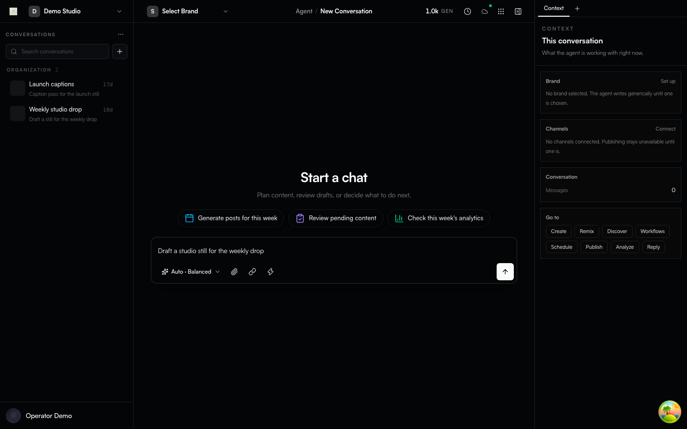
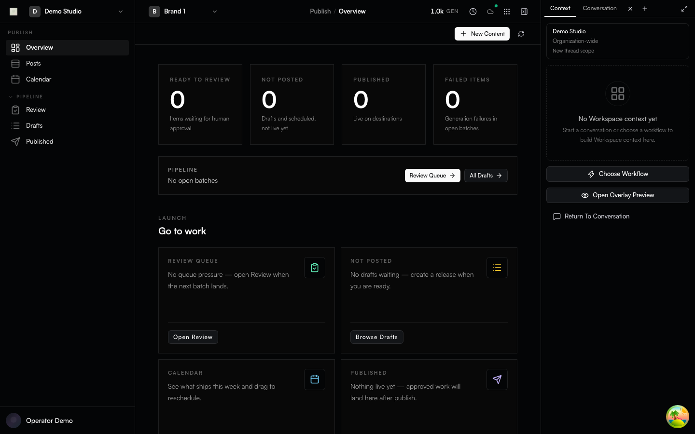
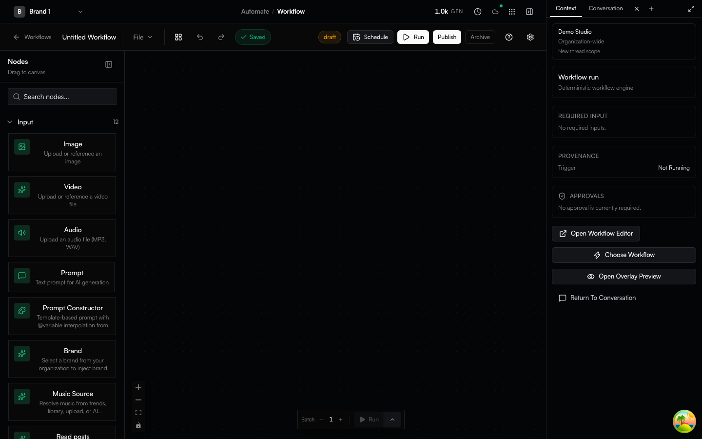

# Genfeed.ai

**The open-source AI OS for content creation.**

[](https://github.com/genfeedai/genfeed.ai/actions/workflows/ci.yml?query=branch%3Amaster)
[](https://github.com/genfeedai/genfeed.ai/releases/latest)
[](LICENSE)

> [!WARNING]
> Genfeed is `0.x` and under active development. Breaking changes ship with an
> **Upgrade note** in the release body; semver becomes strict at `v1.0.0`.

Self-host it (**Community**), run it on your Mac (**Desktop**), or use the
hosted product at [genfeed.ai](https://genfeed.ai) (**SaaS**). Same code, three
[deployment modes](docs/deployment-modes.md).

## Quick start (Community)

Prerequisites: Docker Engine with Docker Compose v2, or Docker Desktop.

```bash
curl -fLO https://github.com/genfeedai/genfeed.ai/releases/latest/download/genfeed-selfhosted.tar.gz
tar -xzf genfeed-selfhosted.tar.gz && cd genfeed-selfhosted-v*
cp .env.example .env && docker compose --env-file .env -f compose.yml up -d
```

| Surface    | Local URL               |
| ---------- | ----------------------- |
| Web UI     | `http://localhost:3000` |
| REST API   | `http://localhost:3010` |
| MCP server | `http://localhost:3014` |

The bundle pins the image for its release, applies Prisma migrations, and seeds
one local user, organization, and brand. No Genfeed Cloud account is required.
Add a provider key to `.env` when you want to run generation.

`npx @genfeedai/create my-genfeed` downloads, checksums, and starts the same
bundle. Checksums, auth, providers, and upgrades:
[self-hosting guide](docs/self-hosting.md).

### Let your coding agent install it

Genfeed is driven by agents, so installing it is a task you can hand to one.
Paste this into Claude Code, Codex, Cursor, or any agent with shell access:

````text
Install Genfeed — the open-source AI content OS — on this machine, then connect
it to yourself over MCP.

1. Check Docker Engine with Compose v2 is available.
2. Start the Community bundle:
   curl -fLO https://github.com/genfeedai/genfeed.ai/releases/latest/download/genfeed-selfhosted.tar.gz
   tar -xzf genfeed-selfhosted.tar.gz && cd genfeed-selfhosted-v*
   cp .env.example .env && docker compose --env-file .env -f compose.yml up -d
3. Wait for http://localhost:3000 to answer. The seed creates one user,
   organization (slug `default`), and brand.
4. Ask me to open http://localhost:3000/default/~/settings/api-keys, create a key
   with the **MCP** preset, and paste it back. Never read it out of a file.
5. Register the server with that key:
   claude mcp add --transport http genfeed --scope user http://localhost:3014/mcp \
     --header "Authorization: Bearer $GENFEED_API_KEY"
6. List the Genfeed tools to confirm the connection, then stop.

Reference: https://github.com/genfeedai/genfeed.ai/blob/master/docs/self-hosting.md
Docs index for agents: https://docs.genfeed.ai/llms.txt
````

Already on the hosted product? Skip the install — create the key at
[app.genfeed.ai](https://app.genfeed.ai) and point the same client at
`https://mcp.genfeed.ai/mcp`.

The MCP preset is approval-first: an agent can generate, draft, and schedule, but
publishing waits for a human. What each surface exposes and why is in
[Agent Surface](docs/agent-surface.md).



*Mocked Playwright capture of the agent conversation shell. Fixture data, not a live generation.*



*Mocked Playwright capture of the Publish desk.*



*Mocked Playwright capture of Automate workflow authoring.*

## Capabilities

- Generate images, video, text, voice, and audio with local or bring-your-own-key
  execution
- Visual workflow authoring; content library, brand, scheduling, and publishing
- Drive the same loop from the web app, the [`genfeed` CLI](packages/cli), the
  REST API, or any AI agent over [MCP](docs/agent-surface.md)
- PostgreSQL via Prisma; Redis/BullMQ background work
- A Community Docker distribution built from the same AGPL source as the hosted
  image

Availability differs by deployment mode and configured provider. Read
[Deployment Modes](docs/deployment-modes.md) and
[Execution Boundaries](docs/execution-boundaries.md) before relying on a
feature for a specific distribution.

## Deployment modes

| Mode          | Who it is for                         | How you get it                                      |
| ------------- | ------------------------------------- | --------------------------------------------------- |
| **SaaS**      | Hosted multi-tenant product           | [app.genfeed.ai](https://app.genfeed.ai)            |
| **Community** | Self-hosters, one organization        | Checksummed GitHub release bundle (quick start above) |
| **Desktop**   | Solo creators on their own Mac        | Signed macOS artifacts from `desktop-v*` tags       |

Organization billing ships in every image and is gated at runtime
(`GENFEED_CLOUD` / self-host licence) — see the
[billing section](docs/deployment-modes.md#billing-one-build-a-runtime-gate).
Managed inference infrastructure and Fleet/LoRA operations live outside this
public repository.

Desktop is macOS-first. Mobile and browser/IDE extension sources live in the
tree; this repository does not claim a public store listing for them.

## How agents work in this repo

This repository is [agent-native](.agents/memory/architecture/ADR-AGENT-NATIVE-REPO-PUBLIC.md):
most of its code is written by AI agents under human direction, and the tree is
laid out so an agent can be productive from a cold clone.

- **[AGENTS.md](AGENTS.md)** and **[CLAUDE.md](CLAUDE.md)** — operating rules
  every agent (and human) follows: type safety, UI primitives, serializers,
  tenancy filters, commit conventions.
- **[CONTEXT.md](CONTEXT.md)** — the glossary. One spelling per concept, used
  in code, issues, docs, and PRs.
- **`.agents/`** — durable project memory (rules, ADRs under
  `architecture/ADR-*.md`, specs) plus build/dev skills for working *on* the
  app. `MEMORY.md` is the index. **`skills/`** at the repo root is different:
  those are product/content skills the app *ships*.
- **Issues carry EARS acceptance criteria** (`WHEN … THE SYSTEM SHALL …`) so an
  agent can pick one up and know what "done" means. Triage rewrites weak
  criteria; it never bounces.
- **`shipcode:*` labels are internal automation.** They are visible on issues
  and PRs; contributors never apply them.
- **Agent-authored PRs are welcome** when disclosed in the PR body and a named
  human is accountable for the description and verification. Undisclosed
  agent-authored PRs are closed. See
  [CONTRIBUTING.md](CONTRIBUTING.md#agent-authored-prs).

PRs are reviewed by an automated pipeline first, then by the maintainer, who
alone merges.

## Architecture

Genfeed is a Bun/Turborepo monorepo with Next.js clients, NestJS server
workspaces, PostgreSQL/Prisma persistence, and Redis/BullMQ queues. The
Community image bundles the web app, API, workers, files, notifications, and
MCP runtimes into one container and embeds Redis.

```text
apps/
  app/                    Next.js product UI
  server/                 NestJS services and shared server library
  desktop/app/            Electron client (macOS-first release path)
  mobile/app/             Expo/React Native client source
  extensions/browser/app/ Chrome extension source
  extensions/ide/app/     VS Code extension source
packages/                 Shared @genfeedai/* packages
docker/                   Community and hosted image definitions
```

The public API is REST/OpenAPI. GraphQL appears only in outbound integrations
such as Shopify.

The stack is declared, not debated per-PR. Replacing an item requires an
accepted ADR **before** code lands (see [GOVERNANCE.md](GOVERNANCE.md)).

| Layer        | Choice                                | Why                                                                                  |
| ------------ | ------------------------------------- | ------------------------------------------------------------------------------------ |
| Runtime + PM | **Bun** + **Turborepo**               | One toolchain for install, scripts, tests, and bundling                              |
| Web          | **Next.js 16** + **React 19**         | App Router, RSC, and the same client for SaaS, Community, and Desktop                |
| API          | **NestJS 11**                         | DI, guards, and tenancy/auth enforcement across services                             |
| Data         | **Prisma 7** + **PostgreSQL**         | One schema, typed queries, migrations shipped with every release                     |
| Queues       | **Redis** + **BullMQ**                | Generation, publishing, and scheduling are background work                           |
| Auth         | **Better Auth**                       | Self-hostable, org-aware, no vendor account required for Community                   |
| Quality      | **Biome**, **Vitest**, **Playwright** | Format+lint in one pass; colocated unit tests; E2E tiers per distribution            |
| Distribution | **Docker Compose** + GHCR             | Checksummed bundle pinned to an image                                                |

More: [Architecture](docs/architecture.md) ·
[Deployment Modes](docs/deployment-modes.md) ·
[Execution Boundaries](docs/execution-boundaries.md) ·
[Agent Surface](docs/agent-surface.md).

## Contributing

Audience order for this repository is self-hosters, then agent contributors,
then human contributors. Development is supported on macOS and Linux (Windows
via WSL2).

```bash
bun install && cp .env.example .env.local
bun run env:sync local --prune-legacy
docker compose -f docker/local/docker-compose.yml up -d postgres redis
bun run dev:setup                  # once per machine
bun run dev:backend:min            # then, in a second terminal:
bun run dev:app                    # → https://app.genfeed.localhost/
```

Portless HTTPS is the default contributor dev path. Fixed-port `dev:debug*`
commands remain an optional debugging path when Portless cannot be used.
Everything else — issue forms and **EARS** criteria, the PR contract (squash +
conventional title + linked issue), the **CLA** (once per GitHub account per
CLA version), agent-authored PR disclosure, and focused verification — is in
[CONTRIBUTING.md](CONTRIBUTING.md).

Governance is one maintainer plus an AI review pipeline:
[GOVERNANCE.md](GOVERNANCE.md). Help and questions: [SUPPORT.md](SUPPORT.md).
Security reports follow [SECURITY.md](SECURITY.md), never a public issue.

## Licence and trademark

- Code: [GNU Affero General Public License v3.0 or later](LICENSE) — the whole
  repository
- Contributions: [Contributor License Agreement](CONTRIBUTING.md#contributor-license-agreement)
  (FSFE FLA 2.1: [ICLA.md](ICLA.md) / [CCLA.md](CCLA.md)), signed once per
  GitHub account per CLA version via CLA Assistant. A newer CLA version applies
  to future contributions; prior contributions keep prior rights.
- Name and logo: [TRADEMARK.md](TRADEMARK.md) — the licence covers the code,
  not the brand

Independently published packages and skills may declare their own license in
their package metadata.

## Links

**Repository docs** (`docs/` in this tree) are for contributors and
self-hosters: [self-hosting](docs/self-hosting.md),
[deployment modes](docs/deployment-modes.md),
[architecture](docs/architecture.md), [agent surface](docs/agent-surface.md),
and [native referral credits](docs/referral-credits.md).
**[docs.genfeed.ai](https://docs.genfeed.ai)** is the product and API
documentation for people using Genfeed. Each side links the other; neither
duplicates the other.

- [Website](https://genfeed.ai) · [Hosted app](https://app.genfeed.ai) · [Product docs](https://docs.genfeed.ai)
- [Releases](https://github.com/genfeedai/genfeed.ai/releases) · [Project board](https://github.com/orgs/genfeedai/projects/12)
- [Issues](https://github.com/genfeedai/genfeed.ai/issues) · [Discussions](https://github.com/genfeedai/genfeed.ai/discussions)
- [Sponsor](https://github.com/sponsors/genfeedai)
