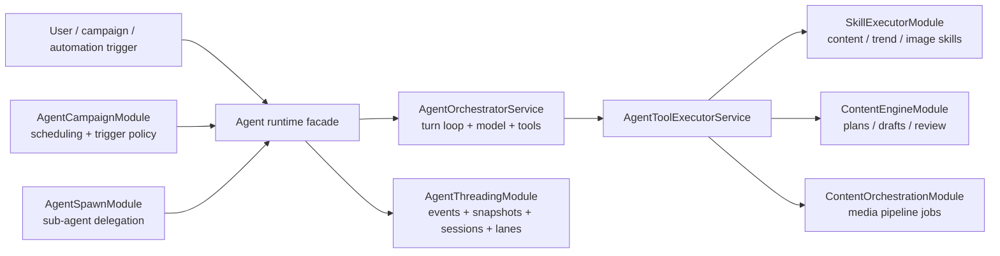

# Agent Orchestration

This page documents the V1 simplification target tracked by `#187`.

## Current Pain Points

The repo has a real agent runtime, but the ownership model is hard to read because several modules still look like competing orchestrators:

- [`apps/server/api/src/services/agent-orchestrator/agent-orchestrator.module.ts`](https://github.com/genfeedai/genfeed.ai/blob/develop/apps/server/api/src/services/agent-orchestrator/agent-orchestrator.module.ts)
  - owns the chat entrypoint, tool loop, model selection, stream start, and credit checks
  - imports a broad graph of collections, integrations, workflow modules, and agent helpers through `forwardRef`
- [`apps/server/api/src/services/agent-threading/agent-threading.module.ts`](https://github.com/genfeedai/genfeed.ai/blob/develop/apps/server/api/src/services/agent-threading/agent-threading.module.ts)
  - owns the event log, projected thread snapshot, runtime session binding, input requests, and per-thread execution lane
- [`apps/server/api/src/services/agent-spawn/agent-spawn.module.ts`](https://github.com/genfeedai/genfeed.ai/blob/develop/apps/server/api/src/services/agent-spawn/agent-spawn.module.ts)
  - delegates work to sub-agents by reaching back into the main orchestrator
- [`apps/server/api/src/services/agent-campaign/agent-campaign-orchestrator.module.ts`](https://github.com/genfeedai/genfeed.ai/blob/develop/apps/server/api/src/services/agent-campaign/agent-campaign-orchestrator.module.ts)
  - owns recurring campaign queues, trigger evaluation, campaign memory extraction, and an older `ContentEngineService`
- [`apps/server/api/src/services/content-engine/content-engine.module.ts`](https://github.com/genfeedai/genfeed.ai/blob/develop/apps/server/api/src/services/content-engine/content-engine.module.ts)
  - owns content plans, drafts, execution, review, and skill-driven content work
- [`apps/server/api/src/services/content-orchestration/content-orchestration.module.ts`](https://github.com/genfeedai/genfeed.ai/blob/develop/apps/server/api/src/services/content-orchestration/content-orchestration.module.ts)
  - owns deterministic media pipeline execution and queueing
- [`apps/server/api/src/services/workflow-executor/workflow-executor.module.ts`](https://github.com/genfeedai/genfeed.ai/blob/develop/apps/server/api/src/services/workflow-executor/workflow-executor.module.ts)
  - owns older workflow processors for persona media, sound overlay, and trend inspiration
- [`apps/server/api/src/services/skill-executor/skill-executor.module.ts`](https://github.com/genfeedai/genfeed.ai/blob/develop/apps/server/api/src/services/skill-executor/skill-executor.module.ts)
  - owns deterministic skill handlers for trend discovery, content writing, and image generation

The pain is not that these modules exist. The pain is that their names and dependencies make it unclear which layer is allowed to own long-running agent state, which layer owns deterministic execution, and which layer is just scheduling or adaptation.

## V1 Target Model

For V1, agent orchestration should read as one runtime with adapter layers around it:



The target ownership rules are:

- **Agent runtime** owns conversational state, thread events, run state, cancellation, input requests, stream events, and tool-loop sequencing.
- **Agent campaign** owns recurrence, trigger policy, queue scheduling, and campaign memory extraction. It should start or resume agent runs through the runtime instead of acting like a second runtime.
- **Agent spawn** owns delegation inputs and child-agent metadata. It should call the runtime through a narrow facade instead of importing the orchestrator directly.
- **Skill executor** owns deterministic skill handlers. It should stay below the tool executor and should not own agent turn state.
- **Content engine** owns content plans, drafts, review, and deterministic execution primitives. It should be callable by agent tools or product controllers.
- **Content orchestration** owns media pipeline jobs and generated asset persistence. It should remain a worker-friendly pipeline executor, not an agent state machine.
- **Workflow executor** is legacy execution surface. New V1 paths should route through content orchestration or skill handlers before adding more processors here.

## Simplified Runtime Boundary

The V1 runtime boundary should be named and documented as a facade even if the implementation is still split internally:

```typescript
interface AgentRuntime {
  startTurn(input: AgentTurnInput): Promise<AgentTurnHandle>;
  startStreamingTurn(input: AgentTurnInput): Promise<AgentTurnHandle>;
  cancelRun(input: AgentRunReference): Promise<void>;
  resolveInput(input: AgentInputResolution): Promise<void>;
  getSnapshot(input: AgentThreadReference): Promise<AgentThreadSnapshot>;
}
```

That facade becomes the only allowed dependency for campaign orchestration, sub-agent spawning, recurring automation, and future CLI/MCP agent triggers.

## Follow-On Implementation Scope

The follow-on work is intentionally narrow enough to land after V1 setup:

1. Add an `AgentRuntimeModule` facade that exports runtime operations backed by `AgentOrchestratorService`, `AgentThreadEngineService`, `AgentRuntimeSessionService`, and `AgentExecutionLaneService`.
2. Migrate `AgentSpawnService` to depend on the runtime facade instead of resolving `AgentOrchestratorService` through `ModuleRef`.
3. Migrate campaign orchestration to create or resume runtime turns through the facade, keeping only recurrence, trigger evaluation, queue scheduling, and memory extraction in `agent-campaign`.
4. Re-home or wrap legacy `workflow-executor` processors behind content orchestration or skill handlers before adding new V1 execution paths.
5. Add a smoke test that proves a campaign trigger creates a runtime run, appends thread events, and records completion through the same snapshot path used by chat.

## V1 Boundary

`#187` does not require deleting every old module before V1. It requires the repo to stop treating every module with "orchestrator" or "executor" in the name as a peer runtime.

The V1 setup target is complete when new work has one obvious path:

`trigger -> AgentRuntime -> AgentOrchestrator + AgentThreading -> tools -> deterministic execution modules`
