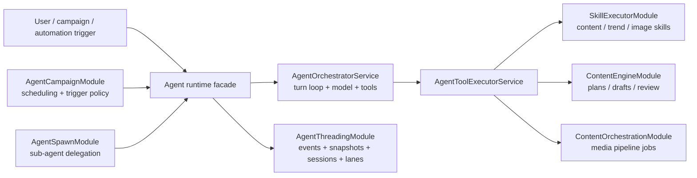

# Agent Orchestration

This page documents the V1 simplification target tracked by `#187`.

## Current Pain Points

The repo has a real agent runtime, but the ownership model is hard to read because several modules still look like competing orchestrators:

- [`apps/server/api/src/services/agent-orchestrator/agent-orchestrator.module.ts`](https://github.com/genfeedai/genfeed.ai/blob/master/apps/server/api/src/services/agent-orchestrator/agent-orchestrator.module.ts)
  - owns the chat entrypoint, tool loop, model selection, stream start, and credit checks
  - imports a broad graph of collections, integrations, workflow modules, and agent helpers through `forwardRef`
- [`apps/server/api/src/services/agent-threading/agent-threading.module.ts`](https://github.com/genfeedai/genfeed.ai/blob/master/apps/server/api/src/services/agent-threading/agent-threading.module.ts)
  - owns the event log, projected thread snapshot, runtime session binding, input requests, and per-thread execution lane
- [`apps/server/api/src/services/agent-spawn/agent-spawn.module.ts`](https://github.com/genfeedai/genfeed.ai/blob/master/apps/server/api/src/services/agent-spawn/agent-spawn.module.ts)
  - delegates work to sub-agents by reaching back into the main orchestrator
- [`apps/server/api/src/services/agent-campaign/agent-campaign-orchestrator.module.ts`](https://github.com/genfeedai/genfeed.ai/blob/master/apps/server/api/src/services/agent-campaign/agent-campaign-orchestrator.module.ts)
  - owns recurring campaign queues, trigger evaluation, campaign memory extraction, and an older `ContentEngineService`
- [`apps/server/api/src/services/content-engine/content-engine.module.ts`](https://github.com/genfeedai/genfeed.ai/blob/master/apps/server/api/src/services/content-engine/content-engine.module.ts)
  - owns content plans, drafts, execution, review, and skill-driven content work
- [`apps/server/api/src/services/content-orchestration/content-orchestration.module.ts`](https://github.com/genfeedai/genfeed.ai/blob/master/apps/server/api/src/services/content-orchestration/content-orchestration.module.ts)
  - owns deterministic media pipeline execution and queueing
- [`apps/server/api/src/services/skill-executor/skill-executor.module.ts`](https://github.com/genfeedai/genfeed.ai/blob/master/apps/server/api/src/services/skill-executor/skill-executor.module.ts)
  - owns deterministic skill handlers for trend discovery, content writing, and image generation

The pain is not that these modules exist. The pain is that their names and dependencies make it unclear which layer is allowed to own long-running agent state, which layer owns deterministic execution, and which layer is just scheduling or adaptation.

## V1 Target Model

For V1, agent orchestration should read as one runtime with adapter layers around it:


```mermaid
flowchart LR
  A["User / campaign / automation trigger"] --> B["Agent runtime facade"]
  B --> C["AgentOrchestratorService\nturn loop + model + tools"]
  B --> D["AgentThreadingModule\nevents + snapshots + sessions + lanes"]
  C --> E["AgentToolExecutorService"]
  E --> F["SkillExecutorModule\ncontent / trend / image skills"]
  E --> G["ContentEngineModule\nplans / drafts / review"]
  E --> H["ContentOrchestrationModule\nmedia pipeline jobs"]
  I["AgentCampaignModule\nscheduling + trigger policy"] --> B
  J["AgentSpawnModule\nsub-agent delegation"] --> B
```

The target ownership rules are:

- **Agent runtime** owns conversational state, thread events, run state, cancellation, input requests, stream events, and tool-loop sequencing.
- **Agent campaign** owns recurrence, trigger policy, queue scheduling, and campaign memory extraction. It should start or resume agent runs through the runtime instead of acting like a second runtime.
- **Agent spawn** owns delegation inputs and child-agent metadata. It should call the runtime through a narrow facade instead of importing the orchestrator directly.
- **Skill executor** owns deterministic skill handlers. It should stay below the tool executor and should not own agent turn state.
- **Content engine** owns content plans, drafts, review, and deterministic execution primitives. It should be callable by agent tools or product controllers.
- **Content orchestration** owns media pipeline jobs and generated asset persistence. It should remain a worker-friendly pipeline executor, not an agent state machine.

## Simplified Runtime Boundary

The V1 runtime boundary should be named and documented as a facade even if the implementation is still split internally:

```typescript
interface AgentRuntime {
  startTurn(input: AgentTurnInput): Promise<AgentTurnHandle>;
  startStreamingTurn(input: AgentTurnInput): Promise<AgentTurnHandle>;
  cancelRun(input: AgentRunReference): Promise<void>;
  resolveInput(input: AgentInputResolution): Promise<void>;
  getSnapshot(input: AgentThreadReference): Promise<AgentThreadSnapshot>;
}
```

That facade becomes the only allowed dependency for campaign orchestration, sub-agent spawning, recurring automation, and future CLI/MCP agent triggers.

## Follow-On Implementation Scope

The follow-on work is intentionally narrow enough to land after V1 setup:

1. Add an `AgentRuntimeModule` facade that exports runtime operations backed by `AgentOrchestratorService`, `AgentThreadEngineService`, `AgentRuntimeSessionService`, and `AgentExecutionLaneService`. **Started:** `AgentRuntimeService.startTurn` exists for campaign callers (thread + run + queue + best-effort `thread.turn_requested`).
2. Migrate `AgentSpawnService` to depend on the runtime facade instead of resolving `AgentOrchestratorService` through `ModuleRef`.
3. Migrate campaign orchestration to create or resume runtime turns through the facade, keeping only recurrence, trigger evaluation, queue scheduling, and memory extraction in `agent-campaign`. **Partial:** `AgentCampaignExecutionService` uses `startTurn`; `content-engine.service.ts` still create-and-queues directly.
4. Add a smoke test that proves a campaign trigger creates a runtime run, appends thread events, and records completion through the same snapshot path used by chat.

## Turn Context Assembly

`AgentOrchestratorContextService.resolveTurnContext` is the single assembly path
for a chat turn: scope, feedback memories, brand context layers, skills, model,
and system prompt. Two callers share it, so what a user inspects is what the
agent sees:

- the chat turn (`resolveSystemPromptAndModel`); and
- the read-only snapshot (`AgentBrandContextSnapshotService`) behind
  `GET /v1/brands/:brandId/agent-context`, the **Brand settings → Agent context**
  page, and the curated `get_brand_context` action (agent and MCP surfaces). The
  snapshot runs a threadless turn and persists nothing.

`AgentContextAssemblyService.assembleContext` builds the brand layers. The chat
path turns on `brandIdentity`, `brandGuidance`, `brandMemory`,
`performancePatterns`, `recentPosts`, `ragContext`, and `brandKnowledge`; the
retrieval layers (`ragContext` and `brandKnowledge`) load only when the turn has
message text.

- `ragContext` retrieves saved brand context through `ContextsService.enhancePrompt`
  with the active `brandId`. Only the brand's own context bases and
  organization-wide bases are eligible; personal Knowledge never is. It renders
  as `## Retrieved Brand Memory`.
- `brandKnowledge` calls `ContextsService.retrieveBrandKnowledge`: ready chunks of
  `BRAND_TRUTH` Knowledge sources owned by the brand or shared org-wide. It
  renders as `## Brand Knowledge`. `INSPIRATION` and `RESEARCH` sources stay
  behind the explicit `search_knowledge` tool.
- Strategy topics render in the strategy section; voice writing rules and
  verbatim exemplar posts render in the voice section.

`renderSystemPrompt` fits the brand context to one character budget and reports
every section as kept, trimmed, or dropped. Reduction order, first to last:
retrieved brand memory, recent posts, historical performance, brand Knowledge,
general, custom instructions, guardrails, brand voice.

The assembled context is cached under the org-scoped `BRAND_CONTEXT` tag. Brand
updates, agent-config writes, brand-interview writes, and brand deletion
invalidate that tag.

## Chat Billing

Each LLM round inside a turn is reserved, run, and settled
(`runReservedAgentLlmRound`). The hold is the round's maximum estimate from
`AgentChatModelRegistryService`. Settlement bills the exact provider cost as
fractional credits: the provider-reported charge when present, otherwise the
answering model's token list price times the reported usage. BYOK rounds and
waived turns (for example, the brand interview) settle at zero. A round that outgrows its
hold settles the hold and deducts the remainder as a separate overflow entry.
Settlement metadata records model, token counts, provider cost, and cost
source, never prompt or completion text.

`AgentModelAccessService` applies the free-tier lock. When organization billing
is live and the organization has no paid subscription (decided by
`resolveOrganizationPaidGrant`), every turn runs on `LLM_DEFAULTS.agentChat`
unless an organization BYOK key pays for the requested route. `GET /agent/credits`
returns the balance, `modelAccess`, and per-model `modelCosts` estimates.

Every surface formats credit amounts through
`packages/contracts/src/constants/credit-display.constant.ts`
(`formatCreditBalance`, `formatCreditBalanceExact`, `formatCreditCost`,
`formatCreditCostEstimate`); the ledger keeps full precision.

Platform admins read margins on **Admin → Administration → Unit Economics**
(`/admin/administration/unit-economics`, `GET /v1/admin/unit-economics`), which
joins credit usage, LLM and media vendor costs, and the `billing_revenue_events`
ledger. Stripe checkout and invoice webhooks write that ledger idempotently per
Stripe object, so revenue exists only from the deploy that introduced it
onward.

## External CLI Runtimes

Genfeed Desktop can run a turn on the user's own Claude Code or Codex CLI
(runtime keys `local/claude-cli` and `local/codex-cli`). The architecture is
CLI + Genfeed MCP + Desktop: Electron main spawns the CLI with only Genfeed MCP
tools allowed, the CLI reads brand context through `get_brand_context`, and
Desktop saves the finished turn with
`POST /v1/agent/threads/:threadId/external-turns`. The API records those turns
without reserving credits and keeps the CLI session id in
`AgentThread.config.externalRuntime` so the next turn resumes it. See the
[desktop README](https://github.com/genfeedai/genfeed.ai/blob/master/apps/desktop/README.md#agent-on-your-claude-code-or-codex-subscription).

## V1 Boundary

`#187` does not require deleting every old module before V1. It requires the repo to stop treating every module with "orchestrator" or "executor" in the name as a peer runtime.

The V1 setup target is complete when new work has one obvious path:

`trigger -> AgentRuntime -> AgentOrchestrator + AgentThreading -> tools -> deterministic execution modules`
