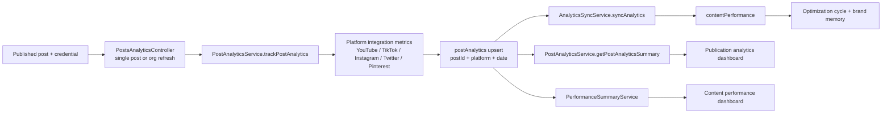
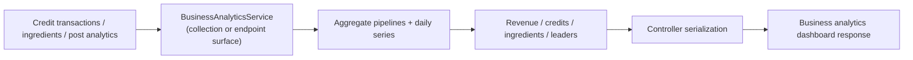
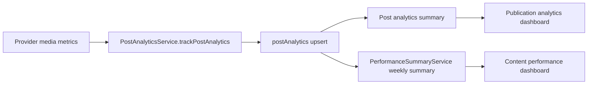

# Analytics Backbone

This page documents the OSS v1 analytics surface tracked by `#160`.

## Live Module Inventory

The repo currently has two real analytics-facing surfaces that matter for v1:

- [`apps/server/api/src/app.module.ts`](https://github.com/genfeedai/genfeed.ai/blob/develop/apps/server/api/src/app.module.ts)
  - imports `BusinessAnalyticsModule`
  - imports `AnalyticsModule`
- Collection-facing business analytics surface:
  - [`apps/server/api/src/collections/business-analytics/business-analytics.module.ts`](https://github.com/genfeedai/genfeed.ai/blob/develop/apps/server/api/src/collections/business-analytics/business-analytics.module.ts)
  - [`apps/server/api/src/collections/business-analytics/services/business-analytics.service.ts`](https://github.com/genfeedai/genfeed.ai/blob/develop/apps/server/api/src/collections/business-analytics/services/business-analytics.service.ts)
  - [`apps/server/api/src/collections/business-analytics/controllers/business-analytics.controller.ts`](https://github.com/genfeedai/genfeed.ai/blob/develop/apps/server/api/src/collections/business-analytics/controllers/business-analytics.controller.ts)
- Endpoint-level analytics surface:
  - [`apps/server/api/src/endpoints/analytics/analytics.module.ts`](https://github.com/genfeedai/genfeed.ai/blob/develop/apps/server/api/src/endpoints/analytics/analytics.module.ts)
  - [`apps/server/api/src/endpoints/analytics/business-analytics.service.ts`](https://github.com/genfeedai/genfeed.ai/blob/develop/apps/server/api/src/endpoints/analytics/business-analytics.service.ts)

## Ownership Notes For V1

The important v1 fact is that analytics is not a single file or a dead stub. There is a real split:

- **Collection surface**: superadmin/business-style rollups backed by credit and ingredient data
- **Endpoint surface**: dashboard-oriented aggregation and time-series work on the analytics connection
- **Post analytics surface**: provider media metrics stored in `postAnalytics` and exposed to publication-level dashboards
- **Content performance surface**: closed-loop sync from `postAnalytics` into `contentPerformance` for optimization and memory workflows

That split is primarily why `#160` remains open: the v1 story needs the surface documented before deeper OSS/EE extraction work.

## OSS vs EE Ownership Boundary

For v1, analytics is owned by Core when it is required to complete the self-hosted content loop. Enterprise owns analytics when the feature depends on multi-tenant governance, agency/team operations, or commercial billing controls.

| Analytics surface                             | V1 owner                  | Stabilization decision                                                                                                                                              |
| --------------------------------------------- | ------------------------- | ------------------------------------------------------------------------------------------------------------------------------------------------------------------- |
| Provider metric ingestion for published posts | Core (OSS)                | Keep in `apps/server/api/src/collections/posts`. Self-hosted users need a working publish -> analytics feedback path with their own provider credentials.           |
| Publication-level analytics summary           | Core (OSS)                | Keep `PostAnalyticsService.getPostAnalyticsSummary` and the posts analytics controller in Core because they verify whether published content performed.             |
| Content-performance weekly summaries          | Core (OSS)                | Keep `PerformanceSummaryService` in Core for top/worst content, platform summaries, posting-time analysis, top hooks, and week-over-week feedback.                  |
| Closed-loop performance sync                  | Core (OSS), EE-extendable | Keep `AnalyticsSyncService` in Core so analytics can feed optimization and brand memory. EE may add tenant-aware scheduling, retention policy, or governance hooks. |
| Business/operator revenue analytics           | Core for current v1       | Keep the existing business analytics response stable for v1. Revisit extraction only after Cloud/EE billing ownership is clearer.                                   |
| Multi-tenant analytics governance             | Enterprise (`ee/`)        | Tenant isolation, cross-client agency reporting, audit controls, SSO/team-scoped permissions, and commercial reporting belong under `ee/`.                          |
| Billing, quota, and contract reporting        | Enterprise / Cloud        | Commercial billing analytics can consume Core events, but the reporting and entitlement logic should not move into the OSS content loop.                            |

## Extraction Decisions

- Do not extract `postAnalytics`, post analytics controllers, `PerformanceSummaryService`, or `AnalyticsSyncService` out of Core for v1.
- Do not block OSS v1 on a perfect analytics package split; stabilize the existing Core services with smoke paths and docs first.
- Do not move tenant-isolation policy into Core analytics as a hidden requirement. Core remains self-hosted single-tenant by default; EE can wrap or extend the same data flow with organization-level controls.
- Treat the current business analytics module as a compatibility surface for v1. If Cloud billing analytics diverges later, extract commercial reporting behind an EE/Cloud boundary instead of weakening Core analytics.

## Stable Analytics Ingestion Pipeline

The v1 ingestion path starts from published content that has a provider `externalId` and a connected credential:

1. `PostsAnalyticsController.refreshAnalytics` refreshes one post through `POST /posts/:postId/refresh-analytics`.
2. `PostsAnalyticsController.refreshAllAnalytics` refreshes all published posts for an organization through `POST /posts/analytics`.
3. Both paths call `PostAnalyticsService.trackPostAnalytics`.
4. `PostAnalyticsService` dispatches to the platform integration service for YouTube, TikTok, Instagram, Twitter, or Pinterest metrics.
5. The returned provider metrics are upserted into `postAnalytics` by `(postId, platform, date)`.
6. `PostAnalyticsService.getPostAnalyticsSummary` exposes the latest per-post dashboard summary.
7. `PerformanceSummaryService` reads `postAnalytics` for weekly top/worst content, platform performance, posting times, top hooks, and week-over-week trend.
8. `AnalyticsSyncService.syncAnalytics` copies `postAnalytics` rows into `contentPerformance` for the closed-loop optimization and brand-memory path.

Current-day provider metrics are available immediately in the publication analytics summary. Content-performance summaries intentionally use complete historical windows, so current-day rows become eligible once they are no longer today's incomplete provider data.

## Dataflow



The separate business analytics path aggregates monetization and usage data for operator-facing dashboards:



## Representative V1 Smoke Path

The narrow business-analytics verification path for v1 is in:

- [`apps/server/api/src/endpoints/analytics/business-analytics.service.spec.ts`](https://github.com/genfeedai/genfeed.ai/blob/develop/apps/server/api/src/endpoints/analytics/business-analytics.service.spec.ts)

The smoke test proves that representative aggregate inputs are converted into a complete dashboard response with:

- revenue totals
- credit sold/consumed totals
- ingredient totals
- leaderboards
- projections
- comparisons

That is enough to show the ingestion-to-dashboard contract is still wired without adding a large end-to-end analytics harness.

The provider-ingestion smoke path for v1 is in:

- [`apps/server/api/src/collections/content-performance/services/analytics-ingestion-dashboard-smoke.spec.ts`](https://github.com/genfeedai/genfeed.ai/blob/develop/apps/server/api/src/collections/content-performance/services/analytics-ingestion-dashboard-smoke.spec.ts)

It verifies the representative media analytics path:



Run it with:

```bash
TZ=UTC bunx vitest run --config vitest.config.ts src/collections/content-performance/services/analytics-ingestion-dashboard-smoke.spec.ts
```

The content-performance dashboard intentionally excludes current-day metrics because today's provider data is incomplete. The smoke path records a provider ingestion row, verifies the publication analytics summary immediately, then advances the date window and verifies the same row appears in the weekly content-performance summary.

## V1 Boundary

This page documents the active analytics backbone and its current split. It does **not** settle the full OSS-vs-EE extraction decision by itself; it gives the v1 release a concrete, inspectable surface first.
