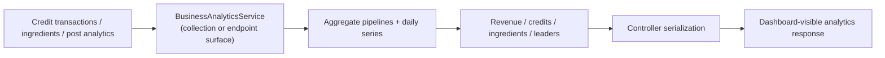
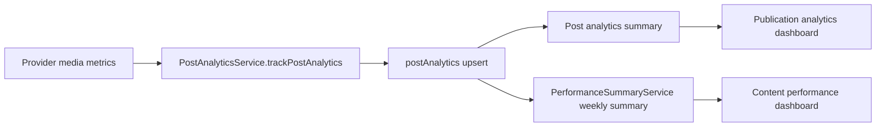

# Analytics Backbone

This page documents the OSS v1 analytics surface tracked by `#160`.

## Live Module Inventory

The repo currently has two real analytics-facing surfaces that matter for v1:

- [`apps/server/api/src/app.module.ts`](https://github.com/genfeedai/genfeed.ai/blob/develop/apps/server/api/src/app.module.ts)
  - imports `BusinessAnalyticsModule`
  - imports `AnalyticsModule`
- Collection-facing business analytics surface:
  - [`apps/server/api/src/collections/business-analytics/business-analytics.module.ts`](https://github.com/genfeedai/genfeed.ai/blob/develop/apps/server/api/src/collections/business-analytics/business-analytics.module.ts)
  - [`apps/server/api/src/collections/business-analytics/services/business-analytics.service.ts`](https://github.com/genfeedai/genfeed.ai/blob/develop/apps/server/api/src/collections/business-analytics/services/business-analytics.service.ts)
  - [`apps/server/api/src/collections/business-analytics/controllers/business-analytics.controller.ts`](https://github.com/genfeedai/genfeed.ai/blob/develop/apps/server/api/src/collections/business-analytics/controllers/business-analytics.controller.ts)
- Endpoint-level analytics surface:
  - [`apps/server/api/src/endpoints/analytics/analytics.module.ts`](https://github.com/genfeedai/genfeed.ai/blob/develop/apps/server/api/src/endpoints/analytics/analytics.module.ts)
  - [`apps/server/api/src/endpoints/analytics/business-analytics.service.ts`](https://github.com/genfeedai/genfeed.ai/blob/develop/apps/server/api/src/endpoints/analytics/business-analytics.service.ts)

## Ownership Notes For V1

The important v1 fact is that analytics is not a single file or a dead stub. There is a real split:

- **Collection surface**: superadmin/business-style rollups backed by credit and ingredient data
- **Endpoint surface**: dashboard-oriented aggregation and time-series work on the analytics connection

That split is primarily why `#160` remains open: the v1 story needs the surface documented before deeper OSS/EE extraction work.

## Dataflow



## Representative V1 Smoke Path

The narrow business-analytics verification path for v1 is in:

- [`apps/server/api/src/endpoints/analytics/business-analytics.service.spec.ts`](https://github.com/genfeedai/genfeed.ai/blob/develop/apps/server/api/src/endpoints/analytics/business-analytics.service.spec.ts)

The smoke test proves that representative aggregate inputs are converted into a complete dashboard response with:

- revenue totals
- credit sold/consumed totals
- ingredient totals
- leaderboards
- projections
- comparisons

That is enough to show the ingestion-to-dashboard contract is still wired without adding a large end-to-end analytics harness.

The provider-ingestion smoke path for v1 is in:

- [`apps/server/api/src/collections/content-performance/services/analytics-ingestion-dashboard-smoke.spec.ts`](https://github.com/genfeedai/genfeed.ai/blob/develop/apps/server/api/src/collections/content-performance/services/analytics-ingestion-dashboard-smoke.spec.ts)

It verifies the representative media analytics path:



Run it with:

```bash
TZ=UTC bunx vitest run --config vitest.config.ts src/collections/content-performance/services/analytics-ingestion-dashboard-smoke.spec.ts
```

The content-performance dashboard intentionally excludes current-day metrics because today's provider data is incomplete. The smoke path records a provider ingestion row, verifies the publication analytics summary immediately, then advances the date window and verifies the same row appears in the weekly content-performance summary.

## V1 Boundary

This page documents the active analytics backbone and its current split. It does **not** settle the full OSS-vs-EE extraction decision by itself; it gives the v1 release a concrete, inspectable surface first.
