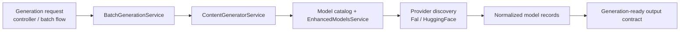

# Generation Service

This page documents the OSS v1 generation surface tracked by `#161`.

## Live Module Inventory

The generation story in the current repo spans a small set of stable entrypoints plus provider packages:

- [`apps/server/api/src/app.module.ts`](https://github.com/genfeedai/genfeed.ai/blob/develop/apps/server/api/src/app.module.ts)
  - imports `BatchGenerationModule`
  - imports the provider-facing integration modules used by generation flows
- [`apps/server/api/src/services/batch-generation/batch-generation.module.ts`](https://github.com/genfeedai/genfeed.ai/blob/develop/apps/server/api/src/services/batch-generation/batch-generation.module.ts)
  - owns the batch-generation controller/service pair
  - persists batch jobs on the cloud connection
- [`apps/server/api/src/services/batch-generation/batch-generation.controller.ts`](https://github.com/genfeedai/genfeed.ai/blob/develop/apps/server/api/src/services/batch-generation/batch-generation.controller.ts)
  - exposes the stable batch entrypoints under `batches`
  - routes create/process/review operations into the service layer
- [`apps/server/api/src/services/batch-generation/batch-generation.service.ts`](https://github.com/genfeedai/genfeed.ai/blob/develop/apps/server/api/src/services/batch-generation/batch-generation.service.ts)
  - builds batch plans
  - delegates actual generation to `ContentGeneratorService`
- [`packages/services/ai/enhanced-models.service.ts`](https://github.com/genfeedai/genfeed.ai/blob/develop/packages/services/ai/enhanced-models.service.ts)
  - merges base catalog models with provider-discovered models
- Provider packages:
  - [`packages/services/ai/providers/fal/fal-provider.service.ts`](https://github.com/genfeedai/genfeed.ai/blob/develop/packages/services/ai/providers/fal/fal-provider.service.ts)
  - [`packages/services/ai/providers/huggingface/huggingface-provider.service.ts`](https://github.com/genfeedai/genfeed.ai/blob/develop/packages/services/ai/providers/huggingface/huggingface-provider.service.ts)

## Stable Generation Surface

For v1, the important point is not every experimental flow. It is the stable path:

1. API/controller accepts a generation or batch request.
2. `BatchGenerationService` or another generation-facing service delegates into content generation.
3. Model/provider selection is resolved from the catalog plus provider-specific discovery.
4. Provider packages normalize discovered models into one Genfeed-facing shape.

## Dataflow

## Representative V1 Smoke Path

The narrow verification path for v1 is in:

- [`packages/services/ai/enhanced-models.service.test.ts`](https://github.com/genfeedai/genfeed.ai/blob/develop/packages/services/ai/enhanced-models.service.test.ts)

The smoke test proves:

- the enhanced model service initializes cleanly
- predefined provider models are merged into the generation-facing catalog
- the resulting model records retain stable `key`, `provider`, and category data expected by callers

This keeps the v1 proof at the provider-registry boundary instead of requiring a full external generation run.

## V1 Boundary

This page documents the current registry and generation surface. It does **not** expand v1 to include every deferred model-registry or training-pipeline item by default.
