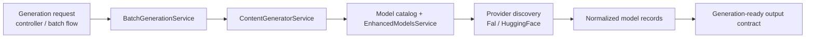

# Generation Service

This page documents the OSS v1 generation surface tracked by `#161`.

## Live Module Inventory

The generation story in the current repo spans a small set of stable entrypoints plus provider packages:

- [`apps/server/api/src/app.module.ts`](https://github.com/genfeedai/genfeed.ai/blob/develop/apps/server/api/src/app.module.ts)
  - imports `BatchGenerationModule`
  - imports the provider-facing integration modules used by generation flows
- [`apps/server/api/src/services/batch-generation/batch-generation.module.ts`](https://github.com/genfeedai/genfeed.ai/blob/develop/apps/server/api/src/services/batch-generation/batch-generation.module.ts)
  - owns the batch-generation controller/service pair
  - persists batch jobs on the cloud connection
- [`apps/server/api/src/services/batch-generation/batch-generation.controller.ts`](https://github.com/genfeedai/genfeed.ai/blob/develop/apps/server/api/src/services/batch-generation/batch-generation.controller.ts)
  - exposes the stable batch entrypoints under `batches`
  - routes create/process/review operations into the service layer
- [`apps/server/api/src/services/batch-generation/batch-generation.service.ts`](https://github.com/genfeedai/genfeed.ai/blob/develop/apps/server/api/src/services/batch-generation/batch-generation.service.ts)
  - builds batch plans
  - delegates actual generation to `ContentGeneratorService`
- [`packages/services/ai/enhanced-models.service.ts`](https://github.com/genfeedai/genfeed.ai/blob/develop/packages/services/ai/enhanced-models.service.ts)
  - merges base catalog models with provider-discovered models
- Provider packages:
  - [`packages/services/ai/providers/fal/fal-provider.service.ts`](https://github.com/genfeedai/genfeed.ai/blob/develop/packages/services/ai/providers/fal/fal-provider.service.ts)
  - [`packages/services/ai/providers/huggingface/huggingface-provider.service.ts`](https://github.com/genfeedai/genfeed.ai/blob/develop/packages/services/ai/providers/huggingface/huggingface-provider.service.ts)

## Stable Generation Surface

For v1, the important point is not every experimental flow. It is the stable path:

1. API/controller accepts a generation or batch request.
2. `BatchGenerationService` or another generation-facing service delegates into content generation.
3. Model/provider selection is resolved from the catalog plus provider-specific discovery.
4. Provider packages normalize discovered models into one Genfeed-facing shape.

## Dataflow



## Representative V1 End-to-End Path

The representative media verification path for v1 is in:

- [`apps/server/api/src/services/skill-executor/stable-provider-path.spec.ts`](https://github.com/genfeedai/genfeed.ai/blob/develop/apps/server/api/src/services/skill-executor/stable-provider-path.spec.ts)

The test uses mocked provider services so it can run in CI without live credentials, but it keeps the production service wiring:

- `SkillExecutorService` loads and validates the `image-generation` skill
- a Content Run is created, marked running, and completed
- the representative image path routes through `ImageGenerationHandler`
- organization BYOK resolution selects fal.ai for the active organization
- the fal.ai provider call receives the resolved server-side key and normalized image parameters
- the completed run records `source: byok`, output metadata, and a generated variant

Run it with:

```bash
cd apps/server/api
TZ=UTC bunx vitest run --config vitest.config.ts src/services/skill-executor/stable-provider-path.spec.ts
```

This keeps the v1 proof end-to-end at the application boundary without making CI depend on external provider availability.

## Explicit V1 Gaps

- The CI smoke path does not make a live fal.ai or Replicate request.
- It verifies one representative image path, not every media type or provider.
- Full provider billing, rate-limit, and callback behavior should stay covered by provider-specific tests and manual release checks.

## V1 Boundary

This page documents the current registry and generation surface. It does **not** expand v1 to include every deferred model-registry or training-pipeline item by default.
