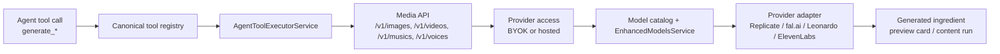

# Generation Service

This page documents the OSS v1 generation surface tracked by `#161`.

## Live Module Inventory

The generation story in the current repo spans a small set of stable entrypoints plus provider packages:

- [`apps/server/api/src/app.module.ts`](https://github.com/genfeedai/genfeed.ai/blob/develop/apps/server/api/src/app.module.ts)
  - imports `BatchGenerationModule`
  - imports the provider-facing integration modules used by generation flows
- [`apps/server/api/src/services/batch-generation/batch-generation.module.ts`](https://github.com/genfeedai/genfeed.ai/blob/develop/apps/server/api/src/services/batch-generation/batch-generation.module.ts)
  - owns the batch-generation controller/service pair
  - persists batch jobs on the cloud connection
- [`apps/server/api/src/services/batch-generation/batch-generation.controller.ts`](https://github.com/genfeedai/genfeed.ai/blob/develop/apps/server/api/src/services/batch-generation/batch-generation.controller.ts)
  - exposes the stable batch entrypoints under `batches`
  - routes create/process/review operations into the service layer
- [`apps/server/api/src/services/batch-generation/batch-generation.service.ts`](https://github.com/genfeedai/genfeed.ai/blob/develop/apps/server/api/src/services/batch-generation/batch-generation.service.ts)
  - builds batch plans
  - delegates actual generation to `ContentGeneratorService`
- [`packages/tools/src/registry/source.agent.ts`](https://github.com/genfeedai/genfeed.ai/blob/develop/packages/tools/src/registry/source.agent.ts)
  - defines the canonical agent-visible generation tools
- [`packages/tools/src/registry/tool-registry.ts`](https://github.com/genfeedai/genfeed.ai/blob/develop/packages/tools/src/registry/tool-registry.ts)
  - assigns generation tool categories and UI action cards
- [`apps/server/api/src/services/agent-orchestrator/tools/agent-tool-executor.service.ts`](https://github.com/genfeedai/genfeed.ai/blob/develop/apps/server/api/src/services/agent-orchestrator/tools/agent-tool-executor.service.ts)
  - dispatches generation tools to the internal media APIs
- [`packages/services/ai/enhanced-models.service.ts`](https://github.com/genfeedai/genfeed.ai/blob/develop/packages/services/ai/enhanced-models.service.ts)
  - merges base catalog models with provider-discovered models
- Provider packages:
  - [`packages/services/ai/providers/fal/fal-provider.service.ts`](https://github.com/genfeedai/genfeed.ai/blob/develop/packages/services/ai/providers/fal/fal-provider.service.ts)
  - [`packages/services/ai/providers/huggingface/huggingface-provider.service.ts`](https://github.com/genfeedai/genfeed.ai/blob/develop/packages/services/ai/providers/huggingface/huggingface-provider.service.ts)

## Stable Generation Surface

For v1, the important point is not every experimental flow. It is the stable path:

1. API/controller accepts a generation or batch request.
2. `BatchGenerationService` or another generation-facing service delegates into content generation.
3. Model/provider selection is resolved from the catalog plus provider-specific discovery.
4. Provider packages normalize discovered models into one Genfeed-facing shape.

## Stable `generate_*` Tool Surface

The v1 stable generation tools are the agent-facing tools that create generation work or route users into a generation review flow. Their metadata is defined in `packages/tools/src/registry/source.agent.ts` and rendered through the canonical registry in `packages/tools/src/registry/tool-registry.ts`.

| Tool                     | Stable input contract                                                                                   | Execution path                                                                                            | Output contract                                               |
| ------------------------ | ------------------------------------------------------------------------------------------------------- | --------------------------------------------------------------------------------------------------------- | ------------------------------------------------------------- |
| `generate_image`         | `prompt`, optional `aspectRatio`; attachments may become reference images                               | `AgentToolExecutorService.generateImage` -> `POST /v1/images` -> image provider selection                 | Content preview card with image ingredient id and gallery URL |
| `generate_video`         | `prompt`, optional `aspectRatio`, `duration`, `imageUrl`, `audioUrl`; image + audio selects avatar mode | `AgentToolExecutorService.generateVideo` -> `POST /v1/videos` -> video provider selection                 | Content preview card with video ingredient id and gallery URL |
| `generate_music`         | `text`, optional `duration`                                                                             | `AgentToolExecutorService.generateMusic` -> `POST /v1/musics` -> music provider selection                 | Content preview card with music ingredient id and gallery URL |
| `generate_voice`         | `text`, `voiceId`                                                                                       | `AgentToolExecutorService.generateVoice` -> `POST /v1/voices/generate` -> voice provider selection        | Content preview card with voice id or audio URL               |
| `generate_content_batch` | `count`, `platforms`, optional `brandId`, `handle`, `dateRange`, `contentMix`, `style`, `topics`        | `AgentToolExecutorService.generateContentBatch` -> `BatchGenerationService.createBatch`                   | Batch id plus review queue/status actions                     |
| `generate_as_identity`   | Identity/avatar generation handoff parameters                                                           | `AgentToolExecutorService.generateAsIdentity` -> saved avatar workflow or image/video generation fallback | Generation action card or generated media result              |

These are the stable tool names callers should depend on for v1. Lower-level workflow categories such as `generate-image`, `generate-video`, and `generate-music` remain workflow-engine step categories, not public agent tool names.

## Step 3 Module -> Provider -> Tool Map

| Layer              | Files                                                                                         | Responsibility                                                                           |
| ------------------ | --------------------------------------------------------------------------------------------- | ---------------------------------------------------------------------------------------- |
| Tool metadata      | `packages/tools/src/registry/source.agent.ts`, `packages/tools/src/registry/tool-registry.ts` | Defines tool names, parameters, categories, and UI action card types                     |
| Agent dispatch     | `apps/server/api/src/services/agent-orchestrator/tools/agent-tool-executor.service.ts`        | Converts tool calls into internal API requests and normalizes preview-card responses     |
| Media APIs         | `/v1/images`, `/v1/videos`, `/v1/musics`, `/v1/voices/generate`                               | Own request validation, model selection, credits, persistence, and completion polling    |
| Skill execution    | `apps/server/api/src/services/skill-executor/*`                                               | Runs content skills such as `image-generation` and records Content Runs                  |
| Provider access    | `apps/server/api/src/services/byok/*`                                                         | Resolves organization BYOK keys before hosted fallback                                   |
| Provider adapters  | `apps/server/api/src/services/integrations/*`, `packages/services/ai/providers/*`             | Call Replicate, fal.ai, Leonardo, ElevenLabs, HuggingFace, and related provider surfaces |
| Registry/discovery | `packages/services/ai/enhanced-models.service.ts`                                             | Merges base model catalog entries with provider-discovered models                        |

## Dataflow

## Representative V1 Smoke Path

The narrow verification path for v1 is in:

- [`packages/services/ai/enhanced-models.service.test.ts`](https://github.com/genfeedai/genfeed.ai/blob/develop/packages/services/ai/enhanced-models.service.test.ts)

The smoke test proves:

- the enhanced model service initializes cleanly
- predefined provider models are merged into the generation-facing catalog
- the resulting model records retain stable `key`, `provider`, and category data expected by callers

This keeps the v1 proof at the provider-registry boundary instead of requiring a full external generation run.

## V1 Boundary

This page documents the current registry and generation surface. It does **not** expand v1 to include every deferred model-registry or training-pipeline item by default.

For the OSS provider registry contract, see [Provider Registry](/core/provider-registry).
