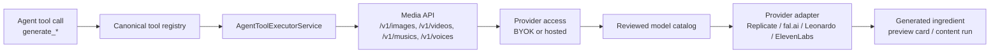

# Generation Service

This page documents the OSS v1 generation surface tracked by `#161`.

## Live Module Inventory

The generation story in the current repo spans a small set of stable entrypoints plus provider packages:

- [`apps/server/api/src/app.module.ts`](https://github.com/genfeedai/genfeed.ai/blob/master/apps/server/api/src/app.module.ts)
  - imports `BatchGenerationModule`
  - imports the provider-facing integration modules used by generation flows
- [`apps/server/api/src/services/batch-generation/batch-generation.module.ts`](https://github.com/genfeedai/genfeed.ai/blob/master/apps/server/api/src/services/batch-generation/batch-generation.module.ts)
  - owns the batch-generation controller/service pair
  - persists batch jobs on the cloud connection
- [`apps/server/api/src/services/batch-generation/batch-generation.controller.ts`](https://github.com/genfeedai/genfeed.ai/blob/master/apps/server/api/src/services/batch-generation/batch-generation.controller.ts)
  - exposes the stable batch entrypoints under `batches`
  - routes create/process/review operations into the service layer
- [`apps/server/server/src/services/batch-generation/batch-generation.service.ts`](https://github.com/genfeedai/genfeed.ai/blob/master/apps/server/server/src/services/batch-generation/batch-generation.service.ts)
  - builds batch plans
  - delegates actual generation to `ContentGeneratorService`
- `packages/actions/src/registry/source/index.ts`
  - defines the canonical agent-visible generation tools
- `packages/actions/src/registry/tool-registry.ts`
  - assigns generation tool categories and UI action cards
- [`apps/server/server/src/services/agent-orchestrator/tools/agent-tool-executor.service.ts`](https://github.com/genfeedai/genfeed.ai/blob/master/apps/server/server/src/services/agent-orchestrator/tools/agent-tool-executor.service.ts)
  - dispatches generation tools to the internal media APIs
- [`apps/server/workers/src/crons/model-watcher/cron.model-watcher.service.ts`](https://github.com/genfeedai/genfeed.ai/blob/master/apps/server/workers/src/crons/model-watcher/cron.model-watcher.service.ts)
  - discovers models from verified Replicate owners into an inactive review queue
- [`packages/agent/src/hooks/use-agent-generation-setup-presets.ts`](https://github.com/genfeedai/genfeed.ai/blob/master/packages/agent/src/hooks/use-agent-generation-setup-presets.ts)
  - builds unified Generation Setup presets from Studio Looks and allowed generation models

## Stable Generation Surface

For v1, the important point is not every experimental flow. It is the stable path:

1. API/controller accepts a generation or batch request.
2. `BatchGenerationService` or another generation-facing service delegates into content generation.
3. Model/provider selection is resolved from reviewed model records in the shared registry.
4. Provider adapters normalize generation results into one Genfeed-facing shape.

## Stable `generate_*` Tool Surface

The v1 stable generation tools are the agent-facing tools that create generation work or route users into a generation review flow. Their metadata is defined in `packages/actions/src/registry/source/index.ts` and rendered through the canonical registry in `packages/actions/src/registry/tool-registry.ts`.

| Tool                     | Stable input contract                                                                                   | Execution path                                                                                            | Output contract                                               |
| ------------------------ | ------------------------------------------------------------------------------------------------------- | --------------------------------------------------------------------------------------------------------- | ------------------------------------------------------------- |
| `generate_image`         | `prompt`, optional `aspectRatio`; attachments may become reference images                               | `AgentToolExecutorService.generateImage` -> `POST /v1/images` -> image provider selection                 | Content preview card with image ingredient id and gallery URL |
| `generate_video`         | `prompt`, optional `aspectRatio`, `duration`, `imageUrl`, `audioUrl`; image + audio selects avatar mode | `AgentToolExecutorService.generateVideo` -> `POST /v1/videos` -> video provider selection                 | Content preview card with video ingredient id and gallery URL |
| `generate_music`         | `text`, optional `duration`                                                                             | `AgentToolExecutorService.generateMusic` -> `POST /v1/musics` -> music provider selection                 | Content preview card with music ingredient id and gallery URL |
| `generate_voice`         | `text`, `voiceId`                                                                                       | `AgentToolExecutorService.generateVoice` -> `POST /v1/voices/generate` -> voice provider selection        | Content preview card with voice id or audio URL               |
| `generate_content_batch` | `count`, `platforms`, optional `brandId`, `handle`, `dateRange`, `contentMix`, `style`, `topics`        | `AgentToolExecutorService.generateContentBatch` -> `BatchGenerationService.createBatch`                   | Batch id plus review queue/status actions                     |
| `generate_as_identity`   | `text` for the identity avatar to speak                                                                 | `AgentToolExecutorService.generateAsIdentity` -> `POST /v1/videos/avatar` with `useIdentity: true`        | Processing preview card for the avatar video generation       |

These are the stable tool names callers should depend on for v1. Lower-level workflow categories such as `generate-image`, `generate-video`, and `generate-music` remain workflow-engine step categories, not public agent tool names.

## Step 3 Module -> Provider -> Tool Map

| Layer              | Files                                                                                         | Responsibility                                                                           |
| ------------------ | --------------------------------------------------------------------------------------------- | ---------------------------------------------------------------------------------------- |
| Tool metadata      | `packages/actions/src/registry/source/index.ts`, `packages/actions/src/registry/tool-registry.ts` | Defines tool names, parameters, categories, and UI action card types                     |
| Agent dispatch     | `apps/server/server/src/services/agent-orchestrator/tools/agent-tool-executor.service.ts`        | Converts tool calls into internal API requests and normalizes preview-card responses     |
| Media APIs         | `/v1/images`, `/v1/videos`, `/v1/musics`, `/v1/voices/generate`                               | Own request validation, model selection, credits, persistence, and completion polling    |
| Skill execution    | `apps/server/api/src/services/skill-executor/*`                                               | Runs content skills such as `image-generation` and records Content Runs                  |
| Provider access    | `apps/server/api/src/services/byok/*`                                                         | Resolves organization BYOK keys before hosted fallback                                   |
| Provider adapters  | `apps/server/api/src/services/integrations/*`                                                | Call Replicate, fal.ai, Leonardo, ElevenLabs, OpenRouter, and related provider surfaces   |
| Registry/discovery | `apps/server/workers/src/crons/model-watcher/cron.model-watcher.service.ts`                   | Creates reviewed Replicate catalog candidates without auto-activation                    |

## Dataflow


```mermaid
flowchart LR
  A["Agent tool call\ngenerate_*"] --> B["Canonical tool registry"]
  B --> C["AgentToolExecutorService"]
  C --> D["Media API\n/v1/images, /v1/videos, /v1/musics, /v1/voices"]
  D --> E["Provider access\nBYOK or hosted"]
  E --> F["Reviewed model catalog"]
  F --> G["Provider adapter\nReplicate / fal.ai / Leonardo / ElevenLabs"]
  G --> H["Generated ingredient\npreview card / content run"]
```

## Representative V1 End-to-End Path

The representative media verification path for v1 is in:

- [`apps/server/api/src/services/skill-executor/stable-provider-path.spec.ts`](https://github.com/genfeedai/genfeed.ai/blob/master/apps/server/api/src/services/skill-executor/stable-provider-path.spec.ts)

The test uses mocked provider services so it can run in CI without live credentials, but it keeps the production service wiring:

- `SkillExecutorService` loads and validates the `image-generation` skill
- a Content Run is created, marked running, and completed
- the representative image path routes through `ImageGenerationHandler`
- organization BYOK resolution selects fal.ai for the active organization
- the fal.ai provider call receives the resolved server-side key and normalized image parameters
- the completed run records `source: byok`, output metadata, and a generated variant

Run it with:

```bash
cd apps/server/api
TZ=UTC bunx vitest run --config vitest.config.ts src/services/skill-executor/stable-provider-path.spec.ts
```

This keeps the v1 proof end-to-end at the application boundary without making CI depend on external provider availability.

## Explicit V1 Gaps

- The CI smoke path does not make a live fal.ai or Replicate request.
- It verifies one representative image path, not every media type or provider.
- Full provider billing, rate-limit, and callback behavior should stay covered by provider-specific tests and manual release checks.

## V1 Boundary

This page documents the current registry and generation surface. It does **not** expand v1 to include every deferred model-registry or training-pipeline item by default.

For the OSS provider registry contract, see [Provider Registry](/core/provider-registry).
