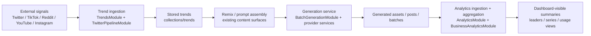

# Core Loop

The v1 release is organized around one operating loop:

`trends -> remix -> generate -> publish -> analytics -> repeat`

The repo already contains the live server surfaces for this loop. This section makes the wiring explicit so the OSS v1 story is inspectable instead of implicit.

## What This Section Covers

- **Step 1: Trend Ingestion**: how trend signals enter the platform and end up in `collections/trends`
- **Step 3: Generation Service**: how generation-facing modules route into provider-backed media and text paths
- **Step 5: Analytics Backbone**: how analytics-facing services aggregate activity into dashboard-visible output

## Why This Matters For V1

The v1 milestone is not blocked on inventing these systems from scratch. It is blocked on making the current surfaces:

- visible in docs
- easier to verify
- easier to reason about as one release candidate

## Core Module Spine

The main server app already wires the three v1 surfaces directly in [`apps/server/api/src/app.module.ts`](https://github.com/genfeedai/genfeed.ai/blob/develop/apps/server/api/src/app.module.ts):

- `TrendsModule`
- `BatchGenerationModule`
- `BusinessAnalyticsModule`
- `AnalyticsModule`
- `TwitterPipelineModule`

## Loop Map

## Representative Smoke Paths

Each v1 area now has one narrow verification path:

- **Trend ingestion**: verify `TrendsService` falls through the cached path into the live-fetch path when cache is empty
- **Generation service**: verify dynamic provider-backed model discovery merges into the stable generation-facing model surface
- **Analytics backbone**: verify `BusinessAnalyticsService` maps aggregate inputs into a complete dashboard response shape

## Related V1 Issues

- `#159` Trend Ingestion API
- `#160` Analytics Backbone
- `#161` Generation Service

Continue with the step-specific pages for the concrete module inventories and smoke-path details.
