# Trend Ingestion

This page documents the OSS v1 trend-ingestion surface tracked by `#159`.

## Live Module Inventory

The current repo has a real Step 1 ingestion path, not a placeholder:

- [`apps/server/api/src/app.module.ts`](https://github.com/genfeedai/genfeed.ai/blob/develop/apps/server/api/src/app.module.ts)
  - imports `TrendsModule`
  - imports `TwitterPipelineModule`
- [`apps/server/api/src/collections/trends/trends.module.ts`](https://github.com/genfeedai/genfeed.ai/blob/develop/apps/server/api/src/collections/trends/trends.module.ts)
  - owns the `Trend`, `TrendingVideo`, `TrendingHashtag`, `TrendingSound`, and reference schemas
  - wires `TrendFetchService`, `TrendFilteringService`, `TrendAnalysisService`, `TrendContentIdeasService`, `TrendVideoService`, `TrendReferenceCorpusService`, and `TrendsService`
- [`apps/server/api/src/collections/trends/services/trends.service.ts`](https://github.com/genfeedai/genfeed.ai/blob/develop/apps/server/api/src/collections/trends/services/trends.service.ts)
  - provides the canonical cached/live-fetch read path
  - hydrates source previews
  - syncs trend references
  - invalidates trend-content cache after fetch
- [`apps/server/api/src/services/twitter-pipeline/twitter-pipeline.service.ts`](https://github.com/genfeedai/genfeed.ai/blob/develop/apps/server/api/src/services/twitter-pipeline/twitter-pipeline.service.ts)
  - provides a focused Twitter-specific search -> draft -> publish path used by the broader trend workflow

## Write Path Into `collections/trends`

The stable v1 shape is:

1. `TrendsService.getTrends()` checks tenant-scoped active trend documents.
2. If nothing is cached, it calls `fetchAndCacheTrends()`.
3. `fetchAndCacheTrends()` delegates to `fetchAndHydrateTrends()`.
4. `fetchAndHydrateTrends()` calls `TrendFetchService.fetchAndCacheTrends(...)`.
5. The fetched trend set is enriched with source previews and then synced into the reference corpus.
6. The trend-content cache is invalidated so downstream readers see the new ingestion result.

## Dataflow

```mermaid
flowchart LR
  A["External platform fetchers"] --> B["TrendFetchService.fetchAndCacheTrends"]
  B --> C["Mongo trend documents\ncollections/trends"]
  C --> D["TrendsService.fetchAndHydrateTrends"]
  D --> E["Source preview hydration"]
  E --> F["TrendReferenceCorpusService.syncTrendReferences"]
  F --> G["Cache invalidation\ntrends:content"]
  G --> H["TrendsService.getTrends / getTrendContent"]
```

## Representative V1 Smoke Path

The narrow verification path for v1 is in:

- [`apps/server/api/src/collections/trends/services/trends.service.spec.ts`](https://github.com/genfeedai/genfeed.ai/blob/develop/apps/server/api/src/collections/trends/services/trends.service.spec.ts)

The smoke test proves the cache-miss path is wired:

- tenant cache miss
- optional global fallback miss
- live fetch path invoked through `fetchAndCacheTrends()`
- fetched trend entities returned to callers with the expected topic/platform shape

That keeps verification repo-native without standing up a full ingestion environment.

## V1 Boundary

This page documents the existing ingestion surface. It does **not** re-scope v1 into new ingestion features or replace lower-level platform-specific issues.
