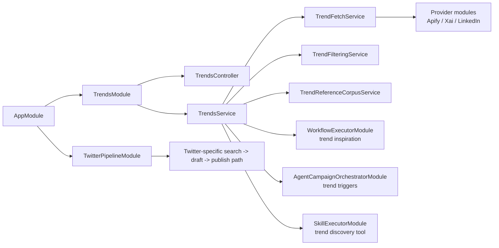

# Trend Ingestion

This page documents the OSS v1 trend-ingestion surface tracked by `#159`.

## Live Module Inventory

The current repo has a real Step 1 ingestion path, not a placeholder:

- [`apps/server/api/src/app.module.ts`](https://github.com/genfeedai/genfeed.ai/blob/develop/apps/server/api/src/app.module.ts)
  - imports `TrendsModule`
  - imports `TwitterPipelineModule`
- [`apps/server/api/src/collections/trends/trends.module.ts`](https://github.com/genfeedai/genfeed.ai/blob/develop/apps/server/api/src/collections/trends/trends.module.ts)
  - owns the `Trend`, `TrendingVideo`, `TrendingHashtag`, `TrendingSound`, and reference schemas
  - wires `TrendFetchService`, `TrendFilteringService`, `TrendAnalysisService`, `TrendContentIdeasService`, `TrendVideoService`, `TrendReferenceCorpusService`, and `TrendsService`
- [`apps/server/api/src/collections/trends/services/trends.service.ts`](https://github.com/genfeedai/genfeed.ai/blob/develop/apps/server/api/src/collections/trends/services/trends.service.ts)
  - provides the canonical cached/live-fetch read path
  - hydrates source previews
  - syncs trend references
  - invalidates trend-content cache after fetch
- [`apps/server/api/src/services/twitter-pipeline/twitter-pipeline.service.ts`](https://github.com/genfeedai/genfeed.ai/blob/develop/apps/server/api/src/services/twitter-pipeline/twitter-pipeline.service.ts)
  - provides a focused Twitter-specific search -> draft -> publish path used by the broader trend workflow

## Module Wiring

`TrendsModule` is the Step 1 ownership boundary. Its imports make the hidden runtime coupling explicit:

| Module dependency                                  | Why it is wired into Step 1                                                                                   |
| -------------------------------------------------- | ------------------------------------------------------------------------------------------------------------- |
| `ApifyModule`                                      | Cross-platform public trend fetchers for TikTok, Instagram, Twitter fallback, YouTube, Reddit, and Pinterest. |
| `XaiModule`                                        | Grok-backed Twitter trend discovery before Apify fallback.                                                    |
| `LinkedInModule`                                   | LinkedIn trend discovery.                                                                                     |
| `CacheModule`                                      | Global trend fetch caching and trend-content cache invalidation.                                              |
| `CredentialsModule`                                | Connected-platform checks and access-control metadata.                                                        |
| `BrandsModule`                                     | Brand-aware trend filtering when tenant/brand context is present.                                             |
| `ModelsModule`                                     | Model metadata used by trend content-idea generation paths.                                                   |
| `ReplicateModule`                                  | Media/model support for trend content-idea workflows.                                                         |
| `ByokModule`                                       | Provider access resolution for generation-adjacent trend workflows.                                           |
| `CreditsModule`                                    | Credit guard/interceptor support around trend-powered AI operations.                                          |
| `InstagramModule`, `TiktokModule`, `TwitterModule` | Platform service access for trend and source-preview paths.                                                   |

`TrendsModule` exports only:

- `TrendsService`
- `TrendPreferencesService`
- `TrendReferenceCorpusService`

Downstream modules should consume those exports instead of reaching into `TrendFetchService`, `TrendFilteringService`, or `TrendAnalysisService` directly. Those module-internal services are the implementation of Step 1, not public cross-module APIs.

The app-level v1 wiring is:



`TwitterPipelineModule` is adjacent to the Step 1 ingestion module, not the owner of `collections/trends` persistence. It can use trend signals for a Twitter workflow, but primary trend document writes remain inside `TrendsModule`.

## Write Path Into `collections/trends`

The stable v1 shape is:

1. `TrendsService.getTrends()` checks tenant-scoped active trend documents.
2. If nothing is cached, it calls `fetchAndCacheTrends()`.
3. `fetchAndCacheTrends()` delegates to `fetchAndHydrateTrends()`.
4. `fetchAndHydrateTrends()` calls `TrendFetchService.fetchAndCacheTrends(...)`.
5. The fetched trend set is enriched with source previews and then synced into the reference corpus.
6. The trend-content cache is invalidated so downstream readers see the new ingestion result.

## Write Contract

The expected Core v1 write contract into `collections/trends` is:

| Write class            | Owner                                                                         | Expected write                                                                                                                   |
| ---------------------- | ----------------------------------------------------------------------------- | -------------------------------------------------------------------------------------------------------------------------------- |
| Provider ingestion     | `TrendFetchService.fetchAndCacheTrends`                                       | `prisma.trend.create` writes one current trend document per provider trend payload.                                              |
| Source-preview hydrate | `TrendsService.persistTrendSourcePreview`                                     | `prisma.trend.update` only updates `data.metadata.sourcePreviewCache`, `data.metadata.sourcePreviewCachedAt`, and preview state. |
| Historical transition  | `TrendAnalysisService.markExpiredTrendsAsHistorical`                          | `prisma.trend.updateMany` marks expired current trend documents historical without deleting them.                                |
| Manual refresh         | `TrendsService.refreshTrends` -> `TrendAnalysisService` + `TrendFetchService` | Existing current rows are marked historical before fresh provider payloads are created.                                          |

Provider-ingested trend documents must include:

- `organizationId` and `brandId`, or `null`/`null` for global cacheable trend documents
- `platform`, `topic`, `mentions`, `growthRate`, and `metadata`
- calculated `viralityScore`
- `requiresAuth` derived from whether the request is tenant-scoped
- `isCurrent: true`
- `expiresAt` using the shorter personalized TTL for tenant-scoped trends and the longer global TTL for global trends

## Audit Result

Representative write paths are consistent with that contract:

- `TrendFetchService.fetchAndCacheTrends` is the only provider-ingestion path that creates `Trend` records during Step 1.
- `TrendsService.fetchAndHydrateTrends` does not create its own trend rows; it delegates creation to `TrendFetchService`, then enriches the saved rows.
- `TrendAnalysisService` owns state-transition writes that mark current/expired trends historical.
- `TrendVideoService` historical writes apply to the `TrendingVideo`, `TrendingHashtag`, and `TrendingSound` collections, not the primary `Trend` documents.
- `TwitterPipelineService` participates in trend-driven workflow behavior, but it does not own `collections/trends` writes.

## Dataflow

```mermaid
flowchart LR
  A["External platform fetchers"] --> B["TrendFetchService.fetchAndCacheTrends"]
  B --> C["Mongo trend documents\ncollections/trends"]
  C --> D["TrendsService.fetchAndHydrateTrends"]
  D --> E["Source preview hydration"]
  E --> F["TrendReferenceCorpusService.syncTrendReferences"]
  F --> G["Cache invalidation\ntrends:content"]
  G --> H["TrendsService.getTrends / getTrendContent"]
```



## Representative V1 Smoke Path

The narrow Step 1 verification paths for v1 are in:

- [`apps/server/api/src/collections/trends/services/trends.service.spec.ts`](https://github.com/genfeedai/genfeed.ai/blob/develop/apps/server/api/src/collections/trends/services/trends.service.spec.ts)
- [`apps/server/api/src/collections/trends/services/modules/trend-fetch.service.spec.ts`](https://github.com/genfeedai/genfeed.ai/blob/develop/apps/server/api/src/collections/trends/services/modules/trend-fetch.service.spec.ts)

The orchestrator smoke test proves the cache-miss path is wired:

- tenant cache miss
- optional global fallback miss
- live fetch path invoked through `fetchAndCacheTrends()`
- fetched trend entities returned to callers with the expected topic/platform shape

The provider persist smoke test proves the ingest -> persist path is wired:

- provider trend payload returned from the TikTok fetcher
- `TrendFetchService.fetchAndCacheTrends()` calculates the v1 virality score
- `prisma.trend.create` persists a current tenant-scoped trend document
- the saved trend is returned as a `TrendEntity`

Run both checks with:

```bash
TZ=UTC bunx vitest run --config vitest.config.ts src/collections/trends/services/trends.service.spec.ts src/collections/trends/services/modules/trend-fetch.service.spec.ts
```

That keeps verification repo-native without standing up a full ingestion environment.

## V1 Boundary

This page documents the existing ingestion surface. It does **not** re-scope v1 into new ingestion features or replace lower-level platform-specific issues.
