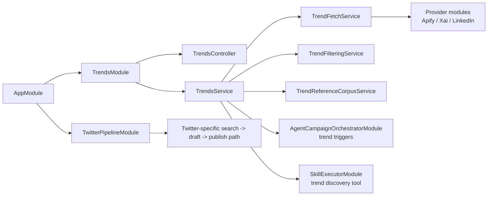

# Trend Ingestion

This page documents the OSS v1 trend-ingestion surface tracked by `#159`.

## Discovery feeds and playable content

Discovery separates account-curated feeds from public trend observations:

- **Following** lives at `/<organization>/<brand>/discovery/following`.
  Existing `discovery/overview?source=following` links redirect there. Connected
  accounts appear automatically; users do not need to enter their follows again.
  Refresh collects X's reverse-chronological home timeline and recent videos from
  YouTube subscriptions. YouTube collection is bounded to 200 subscriptions and
  five recent uploads per channel. Other networks show their current API
  limitations and a link to the native feed.
- **Trends** defaults to public market observations. The brand relevance filter
  is an explicit option; Overview keeps its brand relevance behavior. Video
  cards and topic examples have click-to-play controls. Sound cards retain
  available audio metadata and example videos using that sound. Missing or
  expired media keeps a source link instead of a pretend play control.
- Hashtag and sound counts derived from collected videos say **observed**.
  Growth without a measured comparison window says **not measured**. These
  samples are not platform-wide popularity totals.

Following actions use the selected connected account: X supports likes, replies,
reposts and quotes; YouTube supports likes and comments when granted permissions
allow them. A durable action receipt reserves each idempotency key before calling
the provider. If publication cannot be confirmed, the UI asks the user to check
the source rather than automatically publishing again. Apply the
`20261008160000_source_post_native_actions` Prisma migration before enabling these
actions.

Public collection and account feeds have separate health evidence. Authentication,
API access, rate limits and provider budget failures remain actionable; hiding
them would not restore ingestion. Apify can supply public content and media
metadata, but does not provide native account permissions. Actor availability,
provider credits and credential access must also be healthy for live collection.

## Live Module Inventory

The current repo has a real Step 1 ingestion path, not a placeholder:

- [`apps/server/api/src/app.module.ts`](https://github.com/genfeedai/genfeed.ai/blob/master/apps/server/api/src/app.module.ts)
  - imports `TrendsModule`
  - imports `TwitterPipelineModule`
- [`apps/server/api/src/collections/trends/trends.module.ts`](https://github.com/genfeedai/genfeed.ai/blob/master/apps/server/api/src/collections/trends/trends.module.ts)
  - owns the `Trend`, `TrendingVideo`, `TrendingHashtag`, `TrendingSound`, and reference schemas
  - wires `TrendFetchService`, `TrendFilteringService`, `TrendAnalysisService`, `TrendContentIdeasService`, `TrendVideoService`, `TrendReferenceCorpusService`, and `TrendsService`
- [`apps/server/api/src/collections/trends/services/trends.service.ts`](https://github.com/genfeedai/genfeed.ai/blob/master/apps/server/api/src/collections/trends/services/trends.service.ts)
  - provides the canonical cached/live-fetch read path
  - hydrates source previews
  - syncs trend references
  - invalidates trend-content cache after fetch
- [`apps/server/api/src/services/twitter-pipeline/twitter-pipeline.service.ts`](https://github.com/genfeedai/genfeed.ai/blob/master/apps/server/api/src/services/twitter-pipeline/twitter-pipeline.service.ts)
  - provides a focused Twitter-specific search -> draft -> publish path used by the broader trend workflow

## Stable OSS Surface

For v1, the stable OSS trend-ingestion surface is:

- `TrendsController` for HTTP access to trend discovery, trend content, preferences, related trends, and source-reference views.
- `TrendsService` for cross-module consumers that need current trends, trend content, trend ideas, historical analysis, related trends, and source previews.
- `TrendPreferencesService` for saved tenant/brand trend preferences.
- `TrendReferenceCorpusService` for the source-reference corpus generated from persisted trends.
- `TrendFetchService` as the internal provider ingestion implementation behind `TrendsService.fetchAndCacheTrends`.

The stable surface is not:

- direct cross-module access to provider clients
- direct writes to `prisma.trend` outside the trend services
- a guarantee that every platform has native API access in OSS
- a replacement for lower-level platform-specific ingestion issues

## Module Wiring

`TrendsModule` is the Step 1 ownership boundary. Its imports make the hidden runtime coupling explicit:

| Module dependency                                  | Why it is wired into Step 1                                                                                   |
| -------------------------------------------------- | ------------------------------------------------------------------------------------------------------------- |
| `ApifyModule`                                      | Cross-platform public trend fetchers for TikTok, Instagram, Twitter fallback, YouTube, Reddit, and Pinterest. |
| `XaiModule`                                        | Grok-backed Twitter trend discovery before Apify fallback.                                                    |
| `LinkedInModule`                                   | LinkedIn trend discovery.                                                                                     |
| `CacheModule`                                      | Global trend fetch caching and trend-content cache invalidation.                                              |
| `CredentialsModule`                                | Connected-platform checks and access-control metadata.                                                        |
| `BrandsModule`                                     | Brand-aware trend filtering when tenant/brand context is present.                                             |
| `ModelsModule`                                     | Model metadata used by trend content-idea generation paths.                                                   |
| `ReplicateModule`                                  | Media/model support for trend content-idea workflows.                                                         |
| `ByokModule`                                       | Provider access resolution for generation-adjacent trend workflows.                                           |
| `CreditsModule`                                    | Credit guard/interceptor support around trend-powered AI operations.                                          |
| `InstagramModule`, `TiktokModule`, `TwitterModule` | Platform service access for trend and source-preview paths.                                                   |

`TrendsModule` exports only:

- `TrendsService`
- `TrendPreferencesService`
- `TrendReferenceCorpusService`

Downstream modules should consume those exports instead of reaching into `TrendFetchService`, `TrendFilteringService`, or `TrendAnalysisService` directly. Those module-internal services are the implementation of Step 1, not public cross-module APIs.

The app-level v1 wiring is:


```mermaid
flowchart LR
  A["AppModule"] --> B["TrendsModule"]
  A --> C["TwitterPipelineModule"]
  B --> D["TrendsController"]
  B --> E["TrendsService"]
  E --> F["TrendFetchService"]
  E --> G["TrendFilteringService"]
  E --> H["TrendReferenceCorpusService"]
  F --> I["Provider modules\nApify / Xai / LinkedIn"]
  E --> K["AgentCampaignOrchestratorModule\ntrend triggers"]
  E --> L["SkillExecutorModule\ntrend discovery tool"]
  C --> M["Twitter-specific search -> draft -> publish path"]
```

`TwitterPipelineModule` is adjacent to the Step 1 ingestion module, not the owner of `collections/trends` persistence. It can use trend signals for a Twitter workflow, but primary trend document writes remain inside `TrendsModule`.

## Write Path Into `collections/trends`

The stable v1 shape is:

1. `TrendsService.getTrends()` checks tenant-scoped active trend documents.
2. If nothing is cached, it calls `fetchAndCacheTrends()`.
3. `fetchAndCacheTrends()` delegates to `fetchAndHydrateTrends()`.
4. `fetchAndHydrateTrends()` calls `TrendFetchService.fetchAndCacheTrends(...)`.
5. The fetched trend set is enriched with source previews and then synced into the reference corpus.
6. The trend-content cache is invalidated so downstream readers see the new ingestion result.

## Write Contract

The expected Core v1 write contract into `collections/trends` is:

| Write class            | Owner                                                                         | Expected write                                                                                                                   |
| ---------------------- | ----------------------------------------------------------------------------- | -------------------------------------------------------------------------------------------------------------------------------- |
| Provider ingestion     | `TrendFetchService.fetchAndCacheTrends`                                       | `prisma.trend.create` writes one current trend document per provider trend payload.                                              |
| Source-preview hydrate | `TrendsService.persistTrendSourcePreview`                                     | `prisma.trend.update` only updates `data.metadata.sourcePreviewCache`, `data.metadata.sourcePreviewCachedAt`, and preview state. |
| Historical transition  | `TrendAnalysisService.markExpiredTrendsAsHistorical`                          | `prisma.trend.updateMany` marks expired current trend documents historical without deleting them.                                |
| Manual refresh         | `TrendsService.refreshTrends` -> `TrendAnalysisService` + `TrendFetchService` | Existing current rows are marked historical before fresh provider payloads are created.                                          |

Provider-ingested trend documents must include:

- `organizationId` and `brandId`, or `null`/`null` for global cacheable trend documents
- `platform`, `topic`, `mentions`, `growthRate`, and `metadata`
- calculated `viralityScore`
- `requiresAuth` derived from whether the request is tenant-scoped
- `isCurrent: true`
- `expiresAt` using the shorter personalized TTL for tenant-scoped trends and the longer global TTL for global trends

## Audit Result

Representative write paths are consistent with that contract:

- `TrendFetchService.fetchAndCacheTrends` is the only provider-ingestion path that creates `Trend` records during Step 1.
- `TrendsService.fetchAndHydrateTrends` does not create its own trend rows; it delegates creation to `TrendFetchService`, then enriches the saved rows.
- `TrendAnalysisService` owns state-transition writes that mark current/expired trends historical.
- `TrendVideoService` historical writes apply to the `TrendingVideo`, `TrendingHashtag`, and `TrendingSound` collections, not the primary `Trend` documents.
- `TwitterPipelineService` participates in trend-driven workflow behavior, but it does not own `collections/trends` writes.

## Dataflow


```mermaid
flowchart LR
  A["External platform fetchers"] --> B["TrendFetchService.fetchAndCacheTrends"]
  B --> C["Trend rows (Postgres)\ncollections/trends"]
  C --> D["TrendsService.fetchAndHydrateTrends"]
  D --> E["Source preview hydration"]
  E --> F["TrendReferenceCorpusService.syncTrendReferences"]
  F --> G["Cache invalidation\ntrends:content"]
  G --> H["TrendsService.getTrends / getTrendContent"]
```

## Representative V1 Smoke Path

The narrow Step 1 verification paths for v1 are in:

- [`apps/server/api/src/collections/trends/services/trends.service.spec.ts`](https://github.com/genfeedai/genfeed.ai/blob/master/apps/server/api/src/collections/trends/services/trends.service.spec.ts)
- [`apps/server/api/src/collections/trends/services/modules/trend-fetch.service.spec.ts`](https://github.com/genfeedai/genfeed.ai/blob/master/apps/server/api/src/collections/trends/services/modules/trend-fetch.service.spec.ts)

The orchestrator smoke test proves the cache-miss path is wired:

- tenant cache miss
- optional global fallback miss
- live fetch path invoked through `fetchAndCacheTrends()`
- fetched trend entities returned to callers with the expected topic/platform shape

The provider persist smoke test proves the ingest -> persist path is wired:

- provider trend payload returned from the TikTok fetcher
- `TrendFetchService.fetchAndCacheTrends()` calculates the v1 virality score
- `prisma.trend.create` persists a current tenant-scoped trend document
- the saved trend is returned as a `TrendEntity`

Run both checks with:

```bash
TZ=UTC bunx vitest run --config vitest.config.ts src/collections/trends/services/trends.service.spec.ts src/collections/trends/services/modules/trend-fetch.service.spec.ts
```

That keeps verification repo-native without standing up a full ingestion environment.

## V1 Boundary

This page documents the existing ingestion surface. It does **not** re-scope v1 into new ingestion features or replace lower-level platform-specific issues.

## Refresh evidence and ingestion health

`GET /trends/corpus/health` reads saved corpus data and refresh receipts. Its
`refreshHealth` entries contain platform, dataset, global/scoped source,
`lastAttemptAt`, `completedAt`, `lastSuccessfulRefreshAt`, outcome and a fixed
reason code. Tenant reads include their own receipts and the public corpus.
There are no provider calls, queue submissions or health writes on this GET.

The existing system-workflow node results only retained dataset counts; zero
could mean empty, failed, or fallback, and manual refreshes have no workflow
execution. Refresh receipts therefore use the existing operational event journal
(`NotificationEvent`, source type `trend_refresh_health`) with no deliveries.
This requires no schema migration. Provider responses and credential details are
never stored in the receipt. Cache hits do not create new attempts. A completed
empty response counts as a successful refresh; unavailable native credentials and
provider or persistence failures do not. Successful fallbacks are explicitly
identified. Source health displays real timestamps, distinguishes never-successful
attempts, and keeps missing observations separate from refresh evidence.

The scheduled maintenance entry point checks two fully closed 12-hour windows
aligned to 00:15/12:15 UTC before queuing the next refresh. A durable enrollment
record gives new deployments two windows of grace. Each missing platform/dataset
gets one actionable operator alert through the durable notification outbox;
continued misses share an incident key. The next successful refresh produces a
recovery on the next scheduled health check and allows a later incident to alert
again. Alert delivery failures cannot stop collection. Connected scopes are checked separately from the public corpus, so global fallback
success cannot conceal a failed connected provider. Health alert messages and
metrics carry no tenant identifiers; scoped incident keys use opaque fingerprints.
