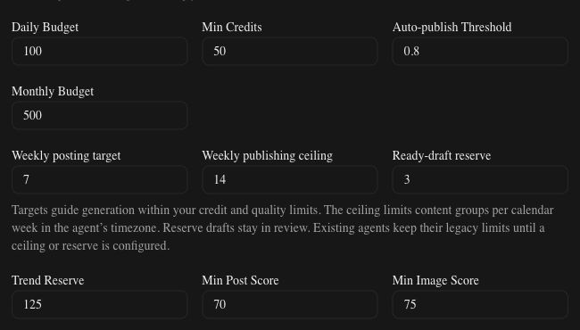

# Agent posting targets and draft reserves

Agent schedule settings separate useful content supply from publishing capacity.

| Control | Purpose | Range |
| --- | --- | --- |
| Weekly posting target | A soft goal for covering the posting calendar | 1–100 |
| Weekly publishing ceiling | A hard limit on scheduled, publishing and published content groups | 1–1000, at least the target |
| Ready-draft reserve | A goal for spare, quality-approved drafts awaiting review | 0–100 |

The image shows the actual editor component in an isolated preview with example
values. These settings can pursue seven weekly posts and three spare drafts while
allowing at most fourteen content groups to publish in a week. Raising a target or
reserve does not increase credit budgets or authorize automatic publishing.

## Calendar and capacity

Configured ceilings use ISO calendar weeks in the agent's timezone and include
future schedules. A group distributed to several platforms counts once; thread
children do not add groups. Editing a counted group or adding a platform sibling
does not consume another slot. Admission is transactional and serialized with
strategy configuration changes, so concurrent writers cannot both take the last
slot.

Publishing checks capacity again in the actual week of delivery. A delayed post
crossing a week boundary, or a post queued before the ceiling was lowered, can be
held by the current ceiling. Earlier scheduling or user approval does not bypass
that limit.

## Replenishment and review

Ready unscheduled drafts and pending generation or review opportunities reduce
uncovered demand. A draft counts as ready only while its content still matches its
passed quality receipt. Material edits, rejection, deletion, scheduling and failure
remove it from the reserve.

Configured proactive runs generate at most five bounded opportunities through the
existing billable text path. Generation and quality attempts must fit the remaining
credit budget. Reserve outputs always await review, including for agents otherwise
authorized to publish automatically. Existing quality and publishing policies stay
effective. Unsupported platform or media generation is held before provider
dispatch; this cadence feature alone does not implement breakout responses.

The performance status reports uncovered target and reserve demand with available
supply, pending approval, capacity and execution constraints. A shortfall does not
force low-quality content or bypass credits, approval or the ceiling.

## Existing agents and edits

Agents without an explicit ceiling or reserve retain their existing rolling-week
and derived daily generation limits. Configuring either control opts into the
separate calendar-week policy. No migration or new environment variable is needed.

When editing configured values, enter a valid replacement instead of leaving the
field blank. Invalid edits disable Save and direct invalid form submission is
rejected. Set the reserve to `0` to stop maintaining spare drafts. Unconfigured
legacy fields remain optional when saving unrelated settings.
