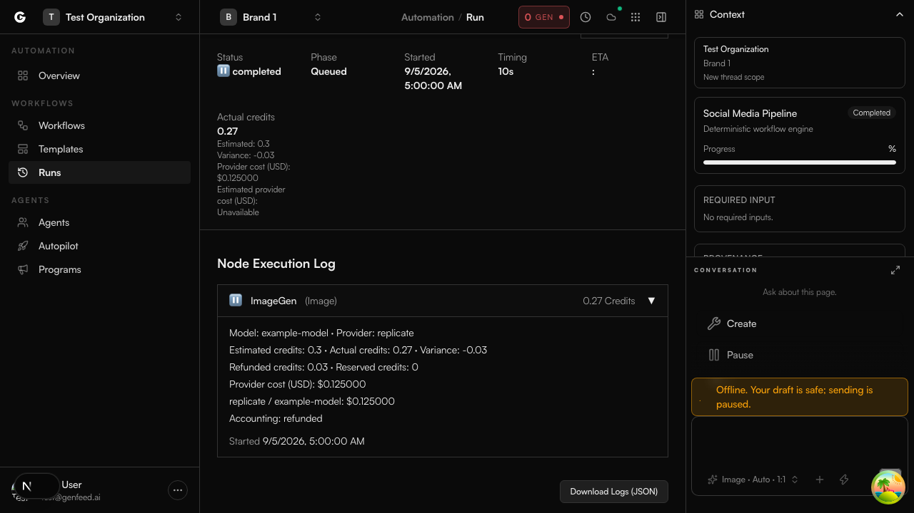

# Workflow cost accounting

Execution details and Cost & Usage show immutable estimates, recorded credits, provider USD, and variance. Estimates do not charge the customer. The historical engine creditsUsed counter is not a billing receipt.

## Deployment

Apply the additive 20260905120000_workflow_cost_accounting migration before deploying the API and workers. Deploy both together: the API produces llm-cost-settlement jobs and workers settle those jobs against the existing LLM vendor ledger. Existing runs retain unavailable estimates; the migration does not invent historical prices or charges.

## Evidence and recovery

Credit transactions and reservations remain the billing authority. Vendor ledgers remain the provider-cost authority. Currency uses integer micro-USD; credit aggregation uses decimal arithmetic. Provider costs are never derived from credits.

Each run captures its estimate before work starts, including pricing provenance and unresolved inputs. Resume and idempotent creation retain the original estimate. Actual totals use current ledger evidence, so later refunds and provider completions remain visible after cancellation or failure.

Provider evidence distinguishes pending, unknown, calculated, observed, and BYOK. Calculated media cost uses submission pricing and realized output dimensions or duration. Observed evidence may upgrade calculated entries; duplicate callbacks cannot downgrade it. Unknown is unavailable, with the known subtotal alongside it. An indeterminate run needs outstanding evidence before reconciliation.

Workflow media intents are saved with the continuation before submission. Reporting recovers incomplete media entries from durable output metadata and pinned pricing. LLM settlement is queued separately from generation: retries only write the frozen receipt and never call the provider again. Failed jobs remain available for inspection and replay. If Redis is unavailable, the API attempts direct persistence. If both stores are unavailable, the existing pending intent remains visible and the correlated error requires reconciliation. No receipt amount is fabricated.

The direct workflow media path uses platform credentials and adds no customer charge. Its intent records that disposition explicitly. Existing billing paths retain their policy.

## Reports

Workflow reporting is a separate view of the canonical ledgers, not an additional financial total. Reports and exports contain the latest 100 executions in the requested period. Brand filtering uses the captured execution brand. Unknown workflow vendor costs are excluded from settled event totals and remain visible in workflow accounting.

CSV includes estimates, actuals, variance, provider micro-USD, states, unresolved reasons, and a JSON node breakdown. Numeric negative variance remains numeric; spreadsheet formula text is escaped.

## Isolated integration audit

Use an empty disposable database with repository schema and migration applied. Never use application or production data. Seed once with apps/server/api/src/collections/workflow-executions/services/fixtures/workflow-accounting.sql.

Set WORKFLOW_ACCOUNTING_TEST_DATABASE_URL to the isolated database. Run the API Vitest spec at src/collections/workflow-executions/services/workflow-accounting.postgres.spec.ts from the API directory. Without the explicit database variable it skips.

The opt-in audit checks exact fractional node/execution totals, estimate variance, provider micro-USD, CSV agreement, and exclusion of a foreign tenant receipt.
